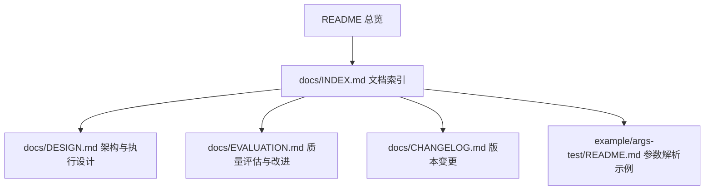
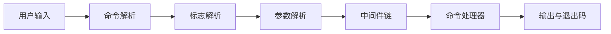
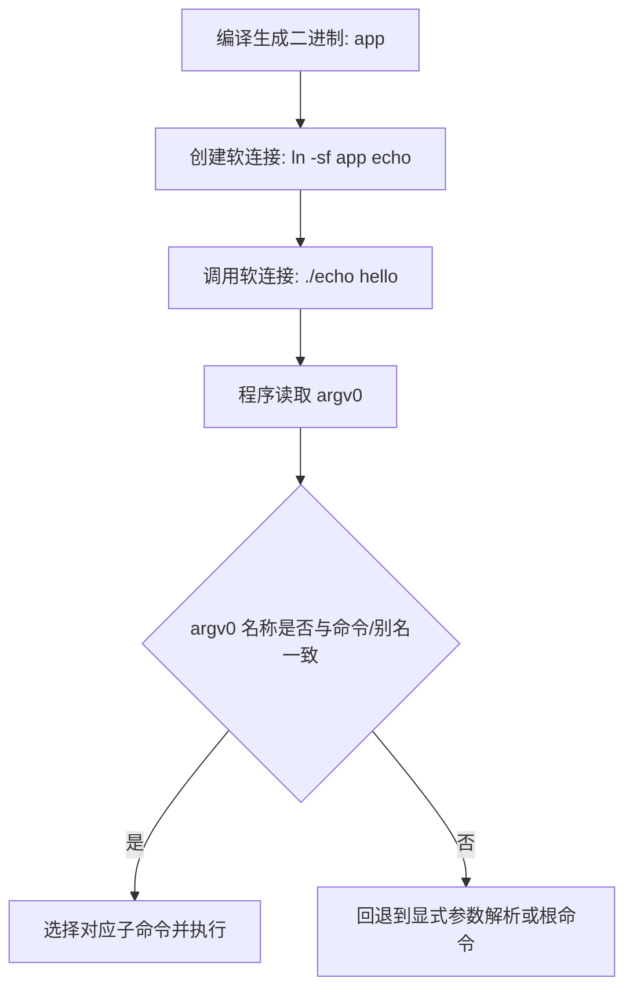
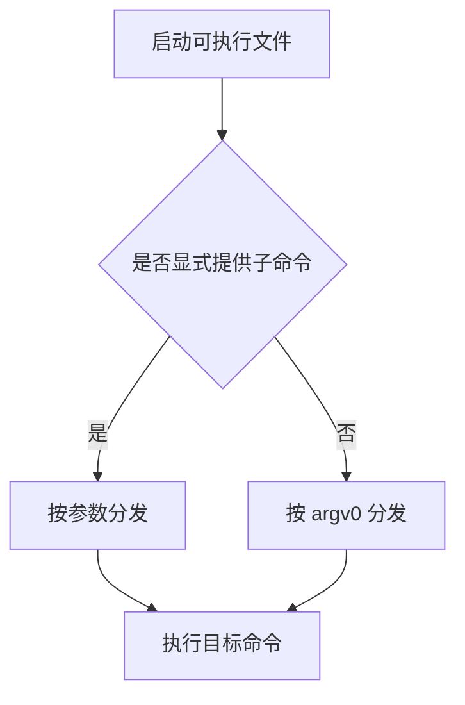
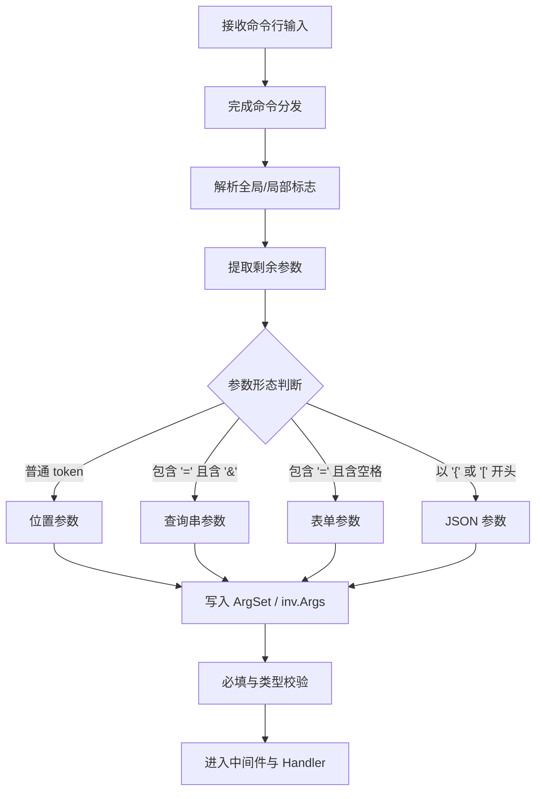
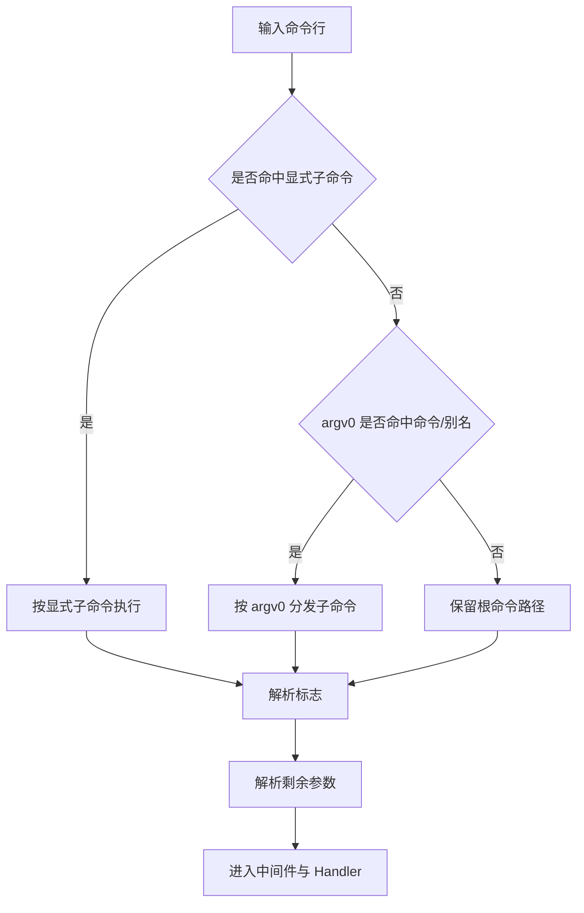

# Redant 命令行框架

Redant 是一个用于构建大型 Go 命令行程序的框架，提供命令树、选项系统、中间件链、帮助系统与多格式参数解析能力。

## 文档导航



- 文档总索引：[`docs/INDEX.md`](docs/INDEX.md)
- 使用规范速览：[`docs/USAGE_AT_A_GLANCE.md`](docs/USAGE_AT_A_GLANCE.md)
- 架构设计：[`docs/DESIGN.md`](docs/DESIGN.md)
- 评估报告：[`docs/EVALUATION.md`](docs/EVALUATION.md)
- 版本记录：[`docs/CHANGELOG.md`](docs/CHANGELOG.md)
- 参数示例：[`example/args-test/README.md`](example/args-test/README.md)

术语使用请参考：[`docs/INDEX.md`](docs/INDEX.md) 的“术语约定”章节。

## 核心能力

- 命令树与子命令继承（支持嵌套）
- 选项多来源配置（命令行、环境变量、默认值）
- 中间件链式编排
- 自动帮助信息与全局标志
- 多格式参数解析（位置参数、查询串、表单、JSON）
- Busybox 风格 argv0 调度（软链接命令入口）

## 架构总览



## 快速开始

```go
package main

import (
    "context"
    "fmt"
    "os"

    "github.com/pubgo/redant"
)

func main() {
    cmd := redant.Command{
        Use:   "echo <text>",
        Short: "输出传入文本",
        Handler: func(ctx context.Context, inv *redant.Invocation) error {
            if len(inv.Args) == 0 {
                return fmt.Errorf("缺少文本参数")
            }
            fmt.Fprintln(inv.Stdout, inv.Args[0])
            return nil
        },
    }

    if err := cmd.Invoke().WithOS().Run(); err != nil {
        fmt.Fprintln(os.Stderr, err)
        os.Exit(1)
    }
}
```

## Busybox 风格命令入口

通过软链接将一个二进制映射为多个独立命令名，框架会根据 `argv0` 自动分发到对应子命令。

### 完整调用流程（构建到分发）



流程说明：

1. 先构建主二进制（例如 `app`）。
2. 通过 `ln -sf` 创建软连接（例如 `echo -> app`）。
3. 用户调用软连接名（例如 `echo hello`）。
4. 框架读取 `argv0`（此时通常为 `echo`）。
5. 若 `argv0` 与命令名或别名匹配，则直接调用该子命令；否则按常规参数路径继续解析。



示例：

- 显式调用：`app echo hello`
- 软链接调用：`echo hello`

## 参数解析流程

框架在命令分发完成后，会进入统一参数解析阶段，支持位置参数、查询串、表单与 JSON。



参数解析落地示例见：[`example/args-test/README.md`](example/args-test/README.md)。

### 参数解析优先级



优先级顺序：

1. 显式子命令（最高）
2. `argv0` 命令/别名分发
3. 根命令默认路径
4. 标志解析与参数格式解析

## 全局标志

- `--help, -h`：显示帮助
- `--list-commands`：列出命令树
- `--list-flags`：列出所有标志

## 示例目录

- `example/demo`：综合示例
- `example/echo`：最小命令示例
- `example/env-test`：环境变量示例
- `example/globalflags`：全局标志示例
- `example/args-test`：参数格式解析示例

## 许可证

本项目采用 MIT 许可证，详见 [`LICENSE`](LICENSE)。
