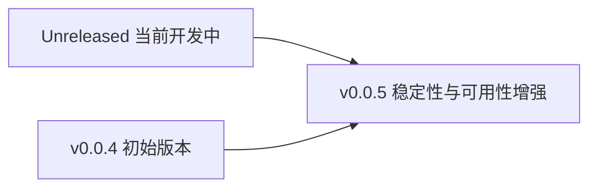

# 变更日志

本文档记录项目的关键版本变化。

> 关联文档：[`文档索引`](INDEX.md) · [`设计文档`](DESIGN.md) · [`评估报告`](EVALUATION.md)

## 版本演进图

## [Unreleased]

### 变更

- 将 `github.com/coder/pretty` 迁移为内部实现 `internal/pretty`，以消除上游停止维护带来的依赖风险。
- `help.go` 改为使用内部导入路径：`github.com/pubgo/redant/internal/pretty`。

### 文档

- 新增内部维护文档：`internal/pretty/README.md`。

## [v0.0.5] - 2026-01-20

### 修复

- 修复 `Int64.Type()` 返回类型错误导致 `pflag.GetInt64()` 获取失败的问题。
- 修复废弃标志告警重复显示的问题。
- 修复子命令无法继承父命令标志的问题。
- 修复 `Option.Default` 默认值未正确应用到实际值的问题。

### 新增

- 增加命令执行相关单元测试（`command_test.go`）。
- 增加标志值类型相关单元测试（`flags_test.go`）。
- 增加框架评估文档（`docs/EVALUATION.md`）。

### 变更

- 优化目录结构，分离核心框架与命令实现。
- 将补全命令移动到 `cmds/completioncmd`。
- 移除配置文件与热更新相关能力，以保持框架简洁。
- 优化 `--list-commands` 输出格式：去掉冗余标题、增强参数展示。
- 优化 `--list-flags` 输出格式：精简子命令路径展示。
- 增强全局标志显示：根命令中非隐藏标志可统一展示为全局标志。

## [v0.0.4] - 2025-12-24

### 新增

- 发布 Redant 初始版本。
- 支持命令树结构与多级子命令。
- 支持命令行标志与环境变量多来源配置。
- 支持中间件链式编排。
- 支持自动帮助系统。
- 支持多格式参数：位置参数、查询串、表单、JSON。
- 支持统一全局标志管理。
- 提供示例工程与基础测试。
