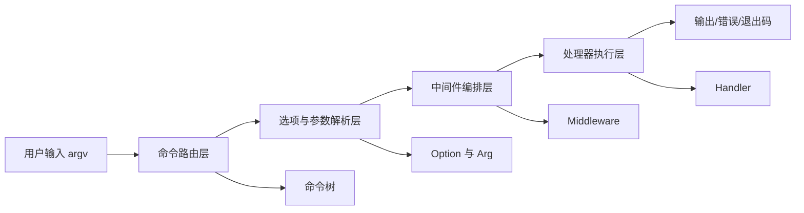
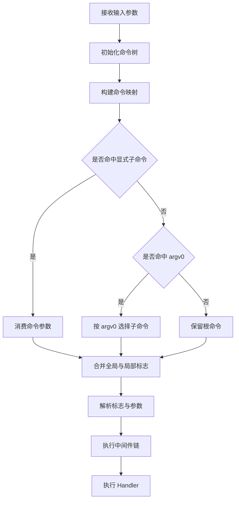
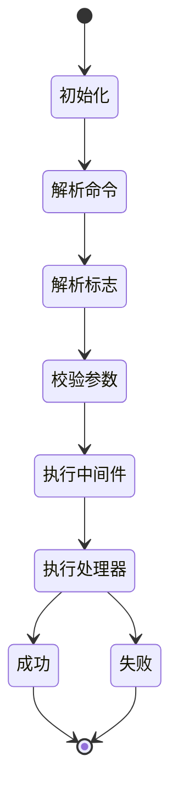
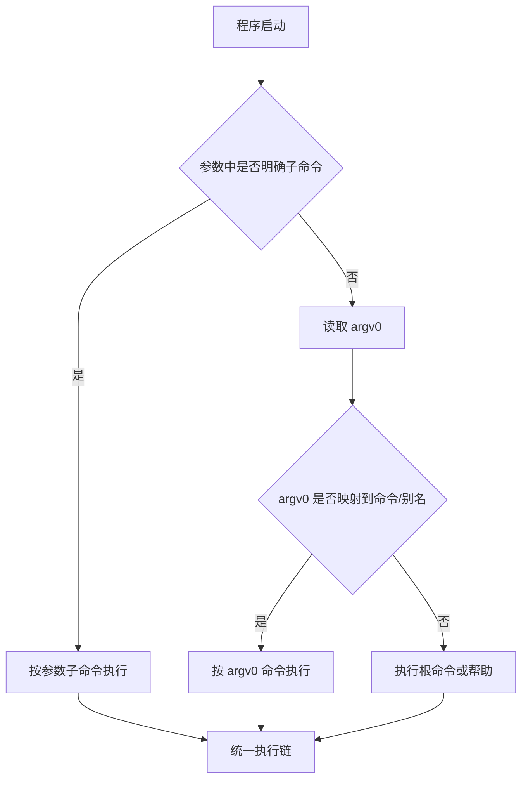

# Redant 设计文档

## 1. 设计目标

Redant 的目标是提供一套可组合、可测试、可扩展的命令行框架，重点解决以下问题：

- 复杂命令树的统一管理
- 多来源参数（标志、环境变量、默认值）的一致解析
- 命令执行链路的可观测与可扩展
- 帮助信息、补全、测试支持的一体化

> 关联文档：[`README`](../README.md) · [`评估报告`](EVALUATION.md) · [`变更日志`](CHANGELOG.md)

## 2. 总体架构

## 3. 命令解析流程

## 4. 执行状态机

## 5. 模块职责

| 模块           | 主要文件               | 说明                               |
| -------------- | ---------------------- | ---------------------------------- |
| 命令系统       | `command.go`           | 命令树、命令查找、执行流程         |
| 选项系统       | `option.go`            | 标志定义、FlagSet 构建             |
| 参数系统       | `args.go`              | 多格式参数解析（查询串/表单/JSON） |
| 值类型系统     | `flags.go`             | 自定义 `pflag.Value` 类型集合      |
| 帮助系统       | `help.go` / `help.tpl` | 帮助渲染、命令与标志展示           |
| 中间件与处理器 | `handler.go`           | 执行链组装与业务回调               |

## 6. Busybox 风格 argv0 分发

说明：

- 显式子命令优先于 argv0。
- argv0 支持命令名与别名。
- 行为用于软链接入口场景，便于将子命令暴露为独立命令。

## 7. 扩展点

- 自定义值类型：实现 `pflag.Value`。
- 自定义中间件：包装 `HandlerFunc` 实现统一鉴权、日志、超时控制。
- 自定义帮助模板：修改 `help.tpl`。
- 新增子命令：扩展 `Command.Children`。

## 8. 文档关联

- 上游：[`README`](../README.md) 提供入口与使用视图。
- 同级：[`EVALUATION.md`](EVALUATION.md) 提供质量视图。
- 下游：[`../example/args-test/README.md`](../example/args-test/README.md) 提供参数解析落地示例。
