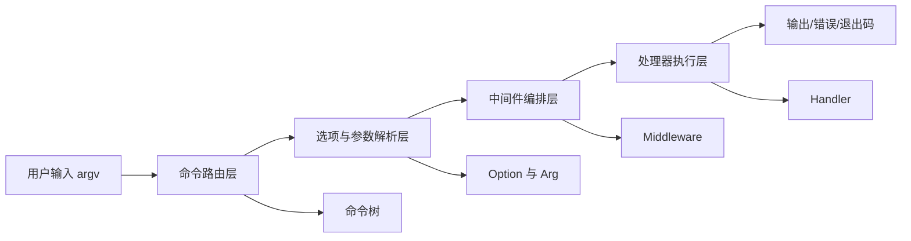
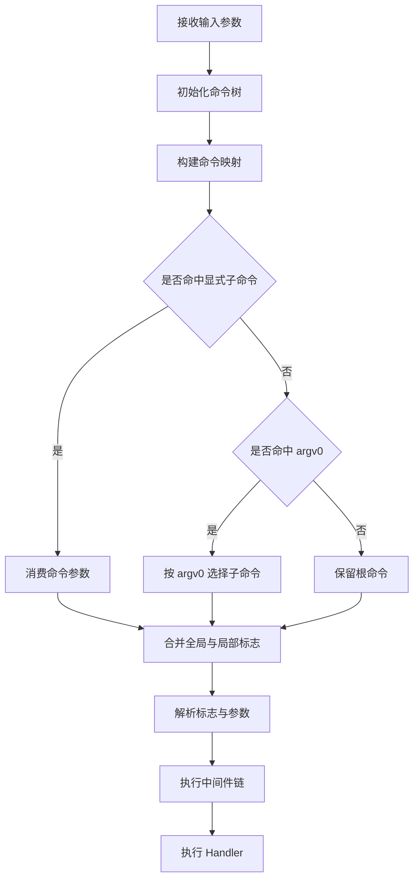
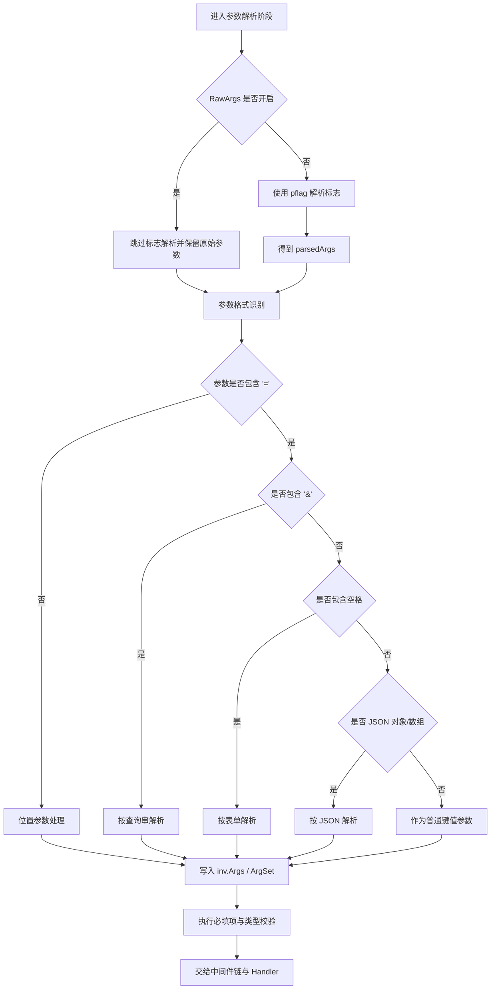
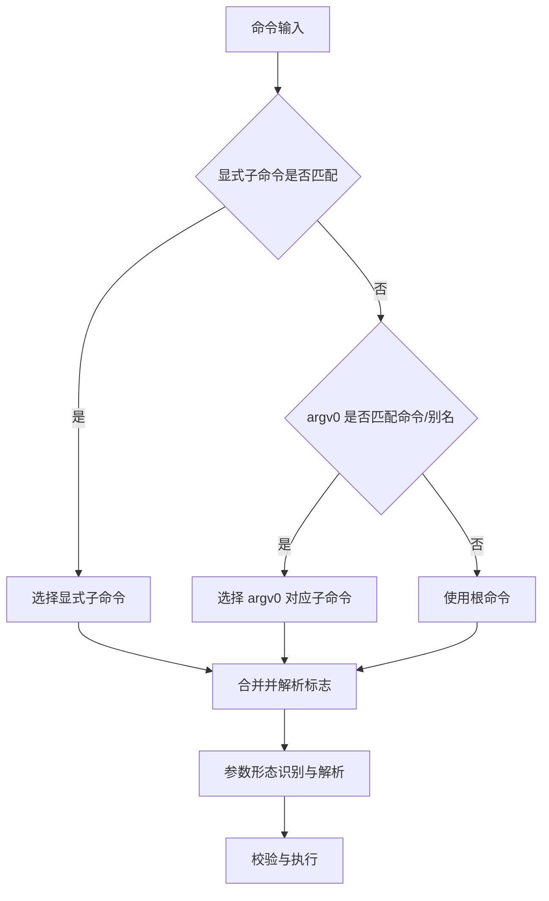
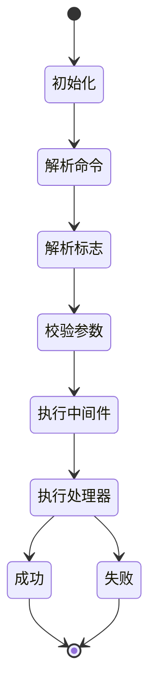
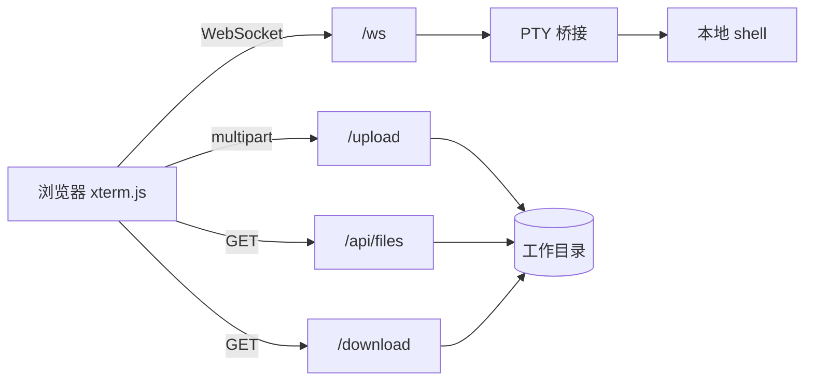
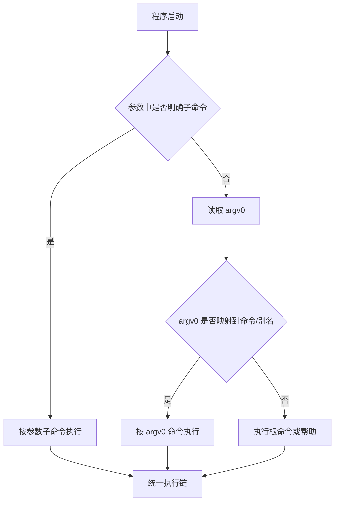
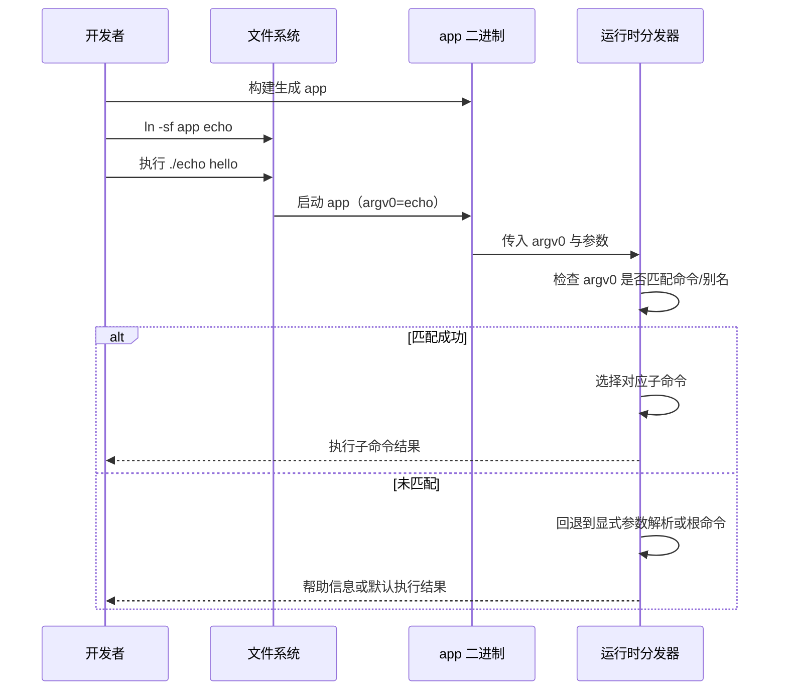
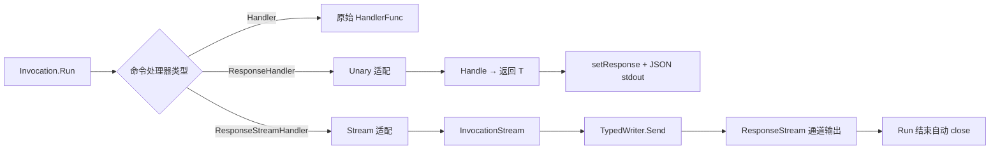
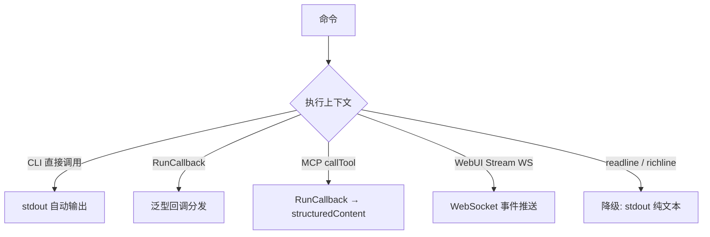

# Redant 设计文档

## 1. 设计目标

Redant 的目标是提供一套可组合、可测试、可扩展的命令行框架，重点解决以下问题：

- 复杂命令树的统一管理
- 多来源参数（标志、环境变量、默认值）的一致解析
- 命令执行链路的可观测与可扩展
- 帮助信息、补全、测试支持的一体化

> 关联文档：[`README`](../README.md) · [`评估报告`](EVALUATION.md) · [`变更日志`](../.version/changelog/README.md)

## 2. 总体架构

## 3. 命令解析流程

### 3.1 参数解析细分流程

关键点：

- 参数解析发生在命令定位与标志合并之后。
- 非 `RawArgs` 模式下，若设置隐藏内部标志 `--args`，则在参数解析前用其值覆盖 `inv.Args`（支持重复与 CSV）。
- `RawArgs=true` 时，命令自行处理参数；框架不做常规标志解析。
- 对于复杂参数场景，建议在处理器中显式调用 `ParseQueryArgs`、`ParseFormArgs`、`ParseJSONArgs`。

### 3.2 解析优先级规则

规则摘要：

1. 显式子命令优先于 `argv0`。
2. `argv0` 仅在未显式指定子命令时生效。
3. 命令最终确定后，才进入标志解析与参数解析阶段。

## 4. 执行状态机

## 5. 模块职责

| 模块           | 主要文件                             | 说明                                            |
| -------------- | ------------------------------------ | ----------------------------------------------- |
| 命令系统       | `command.go`                         | 命令树、命令查找、执行流程                      |
| 选项系统       | `option.go`                          | 标志定义、FlagSet 构建                          |
| 参数系统       | `args.go`                            | 多格式参数解析（查询串/表单/JSON）              |
| 值类型系统     | `flags.go`                           | 自定义 `pflag.Value` 类型集合                   |
| 帮助系统       | `help.go` / `help.tpl`               | 帮助渲染、命令与标志展示                        |
| 中间件与处理器 | `handler.go`                         | 执行链组装与业务回调                            |
| MCP 集成       | `internal/mcpserver` + `cmds/mcpcmd` | 命令树到 MCP Tools 的映射与 stdio 服务          |
| Web 控制台     | `cmds/webcmd` + `internal/webui`     | 可视化命令调试、调用过程展示与执行回放          |
| WebTTY         | `cmds/webttycmd`                     | 最简本地 Web 终端、文件上传/下载与 PTY 信号转发 |

### 5.1 Web 调用过程重建（可观测性）

`internal/webui` 在执行前会根据命令元数据与页面输入重建调用参数：

1. 组装 `argv`（命令路径 + flags + args/rawArgs）。
2. 生成单行 `invocation`（用于后端日志与兼容输出）。
3. 返回 `program + argv` 给前端，前端按 token 渲染为多行 CLI（`\` 续行）。

这样可以同时满足：

- 后端保留稳定的一行调用表示；
- 前端获得可读性更高、便于人工核对的长命令展示。

### 5.2 WebTTY 交互终端（最简独立实现）

`webtty` 与 `web` 控制台分离，定位是“最小可用本地终端”，不复用 `internal/webui`。

关键点：

- 终端控制键（`Ctrl+C/Ctrl+Z`）优先走前台进程组信号转发，失败再回退原始字节写入。
- 上传/下载路径限制在工作目录内，禁止 `..` 越界与绝对路径。
- 前端按“单能力渐进增强”策略演进（拖拽、批量、并发、调度策略、总进度、取消、重试等）。
- 会话层支持前端自动重连（指数退避）与手动重连按钮；当前为“连接恢复”，后续可扩展为“同会话恢复”。

## 6. Busybox 风格 argv0 分发

说明：

- 显式子命令优先于 argv0。
- argv0 支持命令名与别名。
- 行为用于软链接入口场景，便于将子命令暴露为独立命令。

### 6.1 部署与运行时序（构建 + 软连接）

## 7. 扩展点

- 自定义值类型：实现 `pflag.Value`。
- 自定义中间件：包装 `HandlerFunc` 实现统一鉴权、日志、超时控制。
- 自定义帮助模板：修改 `help.tpl`。
- 新增子命令：扩展 `Command.Children`。
- MCP 暴露：挂载 `mcp` 子命令并复用现有命令执行链路对外提供 Tools。

## 8. 文档关联

- 上游：[`README`](../README.md) 提供入口与使用视图。
- 同级：[`EVALUATION.md`](EVALUATION.md) 提供质量视图。
- 同级：[`MCP.md`](MCP.md) 提供 MCP 子命令、Schema 与调用协议说明。
- 同级：[`WEBTTY.md`](WEBTTY.md) 提供 WebTTY 能力说明与分阶段迭代路线。
- 下游：[`../example/args-test/README.md`](../example/args-test/README.md) 提供参数解析落地示例。
- 下游：[`../example/unary/README.md`](../example/unary/README.md) 提供 Unary 响应处理器示例。
- 下游：[`../example/stream-interactive/README.md`](../example/stream-interactive/README.md) 提供流式响应处理器示例。

## 9. 交互式命令与流式处理

为兼容传统一次性命令执行，同时支持类 RPC 的结构化响应输出，Redant 新增了 Unary/Stream 处理能力。

### 处理器类型与适配

### 执行上下文兼容矩阵

设计要点：

1. 保留 `HandlerFunc` 与 `MiddlewareFunc`，不破坏现有执行链。
2. 三类处理器互斥：`Handler`（无响应）、`ResponseHandler`（Unary 单响应）、`ResponseStreamHandler`（流式响应），初始化阶段校验冲突。
3. `ResponseHandler` 通过 `Unary[T]` 泛型适配器构造，返回值自动 JSON 序列化写入 stdout，可通过 `Response()` 或 `RunCallback[T]` 获取。
4. `ResponseStreamHandler` 通过 `Stream[T]` 泛型适配器构造，`TypedWriter[T].Send(v)` 直接发送泛型数据。
5. 响应流通道类型为 `chan any`，通过 `Invocation.ResponseStream()` 消费。
6. `InvocationStream.Send` 自动镜像文本到 stdout、`StreamError` 到 stderr、struct 类型 JSON 序列化到 stdout。
7. `RunCallback[T]` 提供泛型回调消费入口，统一支持 Unary 与 Stream 两种模型的类型化分发。
8. `ResponseTypeInfo` 暴露运行时类型元数据（`TypeName`、`Schema`），供 MCP 等集成层生成输出 Schema。

详见：[`INTERACTIVE_STREAMING.md`](INTERACTIVE_STREAMING.md)。
