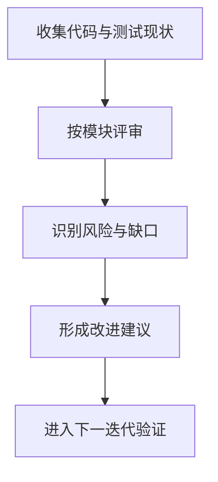
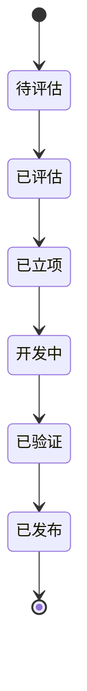

# Redant 评估报告

## 1. 评估范围

本报告聚焦以下维度：

- 架构清晰度
- 功能完整性
- 可测试性与可维护性
- 文档一致性与可读性

> 关联文档：[`设计文档`](DESIGN.md) · [`变更日志`](../.version/changelog/README.md) · [`参数示例`](../example/args-test/README.md)

## 2. 评估流程

## 3. 当前结论

| 维度       | 结论     | 说明                               |
| ---------- | -------- | ---------------------------------- |
| 架构设计   | 良好     | 模块边界清晰，命令执行链路明确     |
| 功能完整性 | 良好     | 命令树、标志、参数、中间件能力齐全 |
| 可测试性   | 中等偏上 | 基础测试较完整，仍有补强空间       |
| 文档质量   | 良好     | 已统一中文并建立逻辑导航           |

## 4. 风险与改进优先级

### 高优先级

- 提升帮助渲染与参数边界场景测试覆盖。
- 补充复杂子命令链路与错误分支回归用例。

### 中优先级

- 评估 FlagSet 构建缓存策略。
- 评估大规模命令树下的查找与初始化耗时。

### 低优先级

- 可选插件化扩展能力。
- 可选配置文件加载中间件。

## 5. 改进闭环状态图

## 6. 版本关联建议

- 每次功能变化先更新 `DESIGN.md` 的流程或状态图。
- 合并前更新 `.version/changelog/Unreleased.md`，记录“新增/修复/变更/文档”。
- 复杂参数变化同步更新 `example/args-test/README.md`。
