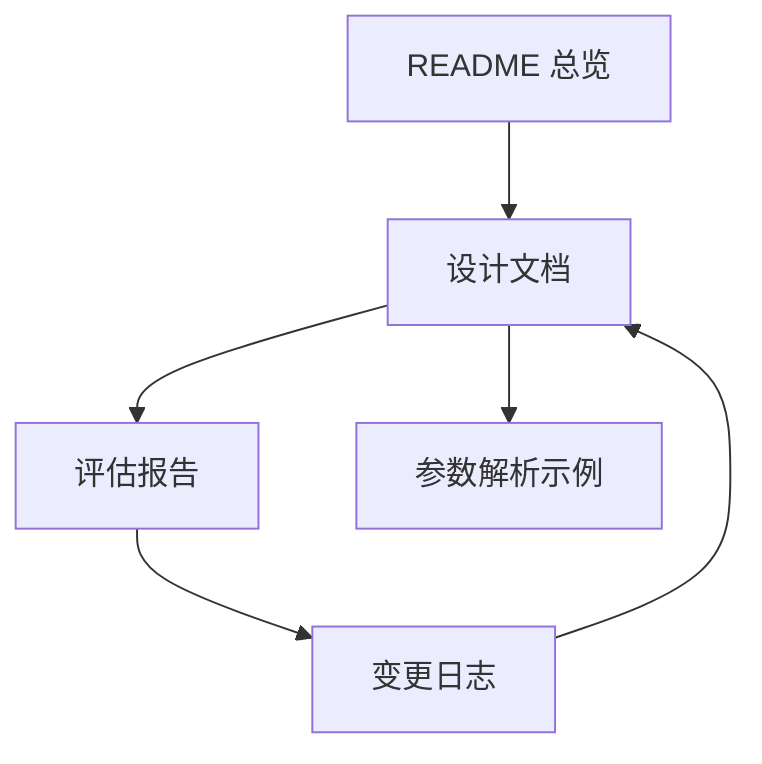

# Redant 文档索引

本文档用于建立全仓库文档之间的逻辑关系，建议按“总览 → 设计 → 评估 → 变更 → 示例”顺序阅读。

## 文档关系图

## 阅读路径

1. [`../README.md`](../README.md)：项目总体介绍、能力边界、快速开始。
2. [`DESIGN.md`](DESIGN.md)：核心模型、解析流程、状态机、扩展点。
3. [`EVALUATION.md`](EVALUATION.md)：当前质量评估、风险、优化建议。
4. [`CHANGELOG.md`](CHANGELOG.md)：版本增量变化，便于追踪设计演进。
5. [`../example/args-test/README.md`](../example/args-test/README.md)：参数解析实操样例。

## 维护约定

- 新增模块时：先更新 `DESIGN.md`，再补充对应示例文档。
- 变更行为时：同步更新 `CHANGELOG.md` 与 `EVALUATION.md` 的风险项。
- 文档统一使用中文，并优先使用 Mermaid 图表达流程、结构与状态。
