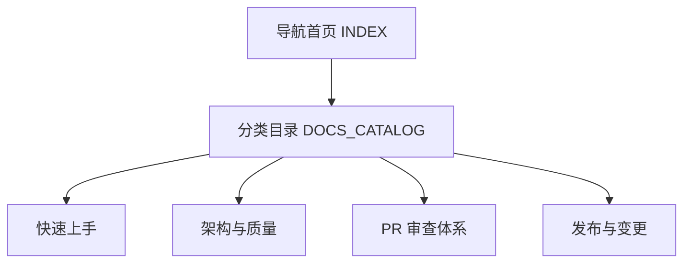

# Redant 文档索引

本文档作为文档导航首页。详细分类请优先使用：[`DOCS_CATALOG.md`](DOCS_CATALOG.md)。

## 文档分层图

## 推荐入口

1. [`DOCS_CATALOG.md`](DOCS_CATALOG.md)：按主题聚合后的单一入口（推荐）。
2. [`USAGE_AT_A_GLANCE.md`](USAGE_AT_A_GLANCE.md)：新同学快速建立 CLI 使用心智模型。
3. [`review/PR_REVIEW_RUBRIC.md`](review/PR_REVIEW_RUBRIC.md)：PR 审查流程基线与轮次规则。
4. [`DESIGN.md`](DESIGN.md)：涉及实现变更时优先查阅。

> 说明：为保持主仓聚焦，`agentline` 与 `copilot-demo` 相关模块/示例已迁移到独立项目维护；本索引仅覆盖 `redant` 主仓当前内容。

## 维护约定

- 新增模块时：先更新 `DESIGN.md`，再补充对应示例文档。
- 变更行为时：同步更新 `.version/changelog/Unreleased.md` 与 `EVALUATION.md` 的风险项。
- 文档统一使用中文，并优先使用 Mermaid 图表达流程、结构与状态。
- 外部依赖迁移到内部实现时，需补充对应内部模块维护文档（如 `internal/*/README.md`）。

## 术语约定

为保证跨文档一致性，统一使用以下术语：

| 术语（中文） | 英文标注     | 说明                                         |
| ------------ | ------------ | -------------------------------------------- |
| 命令         | Command      | 由 `Command` 结构体定义的可执行节点          |
| 根命令       | Root Command | 命令树的顶层命令                             |
| 子命令       | Subcommand   | 挂载在 `Children` 下的命令节点               |
| 别名         | Alias        | 通过 `Aliases` 定义的替代命令名              |
| 参数         | Args         | 命令位置参数及结构化输入（查询串/表单/JSON） |
| 标志         | Flag         | 命令行开关，形式如 `--name`、`-n`            |
| 选项         | Option       | `Option` 配置项定义，最终映射为标志          |

补充规则：

- 文档中首次出现可写作“中文（英文）”，后续优先使用中文术语。
- “参数”与“标志”需明确区分：参数指位置或结构化输入，标志指 `--`/`-` 开关。
