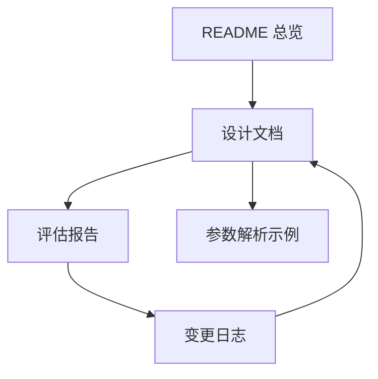

# Redant 文档索引

本文档用于建立全仓库文档之间的逻辑关系，建议按“总览 → 设计 → 评估 → 变更 → 示例”顺序阅读。

## 文档关系图

## 阅读路径

1. [`../README.md`](../README.md)：项目总体介绍、能力边界、快速开始。
2. [`USAGE_AT_A_GLANCE.md`](USAGE_AT_A_GLANCE.md)：子命令命名、参数形态与标志（Flag）规范速览。
3. [`DESIGN.md`](DESIGN.md)：核心模型、解析流程、状态机、扩展点。
4. [`EVALUATION.md`](EVALUATION.md)：当前质量评估、风险、优化建议。
5. [`../.version/changelog/README.md`](../.version/changelog/README.md)：版本增量变化，便于追踪设计演进。
6. [`../example/args-test/README.md`](../example/args-test/README.md)：参数解析实操样例。
7. [`../internal/pretty/README.md`](../internal/pretty/README.md)：内部样式库维护说明（依赖迁移与维护边界）。
8. [`CHANGELOG_LLM_PROMPT.md`](CHANGELOG_LLM_PROMPT.md)：基于 LLM 自动维护 changelog 的提示词模板。
9. [`../README.md#mcp-集成`](../README.md#mcp-集成)：MCP 工具暴露与命令挂载入口。
10. [`../README.md#web-调试界面web-子命令`](../README.md#web-%E8%B0%83%E8%AF%95%E7%95%8C%E9%9D%A2web-%E5%AD%90%E5%91%BD%E4%BB%A4)：Web 控制台使用与调用过程展示说明。
11. [`MCP.md`](MCP.md)：MCP 子命令、工具映射规则、输入输出协议与排查建议。
12. [`WEBTTY.md`](WEBTTY.md)：最简 WebTTY 能力、接口约定与分阶段开发路线。

> 说明：为保持主仓聚焦，`agentline` 与 `copilot-demo` 相关模块/示例已迁移到独立项目维护；本索引仅覆盖 `redant` 主仓当前内容。

## 维护约定

- 新增模块时：先更新 `DESIGN.md`，再补充对应示例文档。
- 变更行为时：同步更新 `.version/changelog/Unreleased.md` 与 `EVALUATION.md` 的风险项。
- 文档统一使用中文，并优先使用 Mermaid 图表达流程、结构与状态。
- 外部依赖迁移到内部实现时，需补充对应内部模块维护文档（如 `internal/*/README.md`）。

## 术语约定

为保证跨文档一致性，统一使用以下术语：

| 术语（中文） | 英文标注     | 说明                                         |
| ------------ | ------------ | -------------------------------------------- |
| 命令         | Command      | 由 `Command` 结构体定义的可执行节点          |
| 根命令       | Root Command | 命令树的顶层命令                             |
| 子命令       | Subcommand   | 挂载在 `Children` 下的命令节点               |
| 别名         | Alias        | 通过 `Aliases` 定义的替代命令名              |
| 参数         | Args         | 命令位置参数及结构化输入（查询串/表单/JSON） |
| 标志         | Flag         | 命令行开关，形式如 `--name`、`-n`            |
| 选项         | Option       | `Option` 配置项定义，最终映射为标志          |

补充规则：

- 文档中首次出现可写作“中文（英文）”，后续优先使用中文术语。
- “参数”与“标志”需明确区分：参数指位置或结构化输入，标志指 `--`/`-` 开关。
