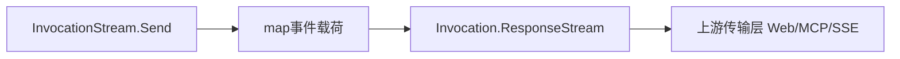
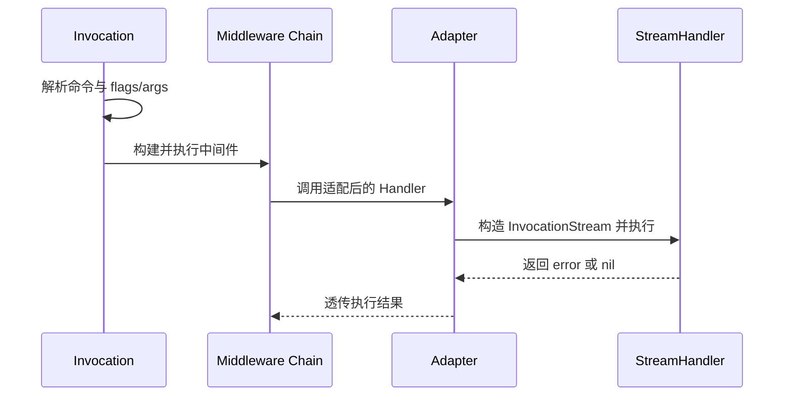

# 交互式命令与流式处理（Stream）

本文档说明 Redant 的交互式命令与响应流新协议设计（非兼容升级）。

## 目标与原则

- 保持命令分发与中间件主链不变。
- 通过新增 `StreamHandler` 提供结构化响应流输出能力。
- 响应流由 Invocation 内部创建并管理，`Run()` 结束后自动关闭。
- Stream 消息采用统一结构化协议，不再保留旧字段兼容层。
- 可按业务阶段发送多段输出；以 `round_end` 事件表示一轮阶段输出完成。

## 新增模型

### Command 扩展

- 新增 `StreamHandler StreamHandlerFunc` 字段。
- 运行时优先级：`StreamHandler` > `Handler`。

### Invocation 扩展

- 新增 `ResponseStream() <-chan map[string]any`。
- 响应流通道由内部创建，调用方仅消费，不注入。

### Stream 事件



事件类型：

- `output`：标准输出语义
- `error`：错误输出语义
- `control`：控制消息（如阶段边界、退出信号）

### 流事件载荷（轻量模型）

为适配 command-as-web / command-as-mcp 场景，流事件统一收敛为：

- `event`：事件标签（如 `output`）
- `data`：结构化负载
- `error`：结构化错误（`code/message/details`）

说明：该模型不保留 `Kind/Payload` 旧字段，也不再携带 `jsonrpc/id/type/round/meta`。

### Method 约定表

| event          | 说明                       |
| -------------- | -------------------------- |
| `output`       | 普通输出事件               |
| `output_chunk` | 分片输出事件               |
| `control`      | 通用控制事件               |
| `round_end`    | 当前阶段输出结束事件       |
| `error`        | 结构化错误事件             |
| `exit`         | 会话结束事件（含退出信息） |

## 执行路径



说明：

1. 中间件仍复用原 `MiddlewareFunc` 机制。
2. `AdaptStreamHandler` 将流处理器接入现有执行链。
3. `Send` 写入内部响应流，并可镜像到 `Stdout/Stderr`。
4. 通过 `Send(map[string]any{...})` 显式发送事件（如 `round_end`），表示当前阶段结束。
5. `inv.Run()` 为阻塞调用；当执行结束时内部响应流会自动关闭。

## 开发任务同步（本次）

- [x] 增加 `StreamHandlerFunc` 与 `InvocationStream`。
- [x] 增加轻量流事件载荷与事件类型定义。
- [x] 增加 `Invocation.ResponseStream()`。
- [x] 在执行链中接入 `StreamHandler` 优先策略。
- [x] 增加回归测试：stdio 输出 + 内建响应流消费模式。
- [ ] 后续任务：补充流式中间件（按事件级拦截）。
- [x] 完成非兼容升级：移除旧消息字段兼容。

## 使用示例

```go
cmd := &redant.Command{
    Use: "chat",
    StreamHandler: func(ctx context.Context, stream *redant.InvocationStream) error {
        if err := stream.Send(map[string]any{"event": "control", "data": "phase:init"}); err != nil {
            return err
        }
        if err := stream.Send(map[string]any{"event": "output", "data": "hello"}); err != nil {
            return err
        }
        return stream.Send(map[string]any{"event": "round_end", "data": map[string]any{"reason": "done"}})
    },
}
```

说明：调用方通过 `ResponseStream()` 消费结构化响应事件。