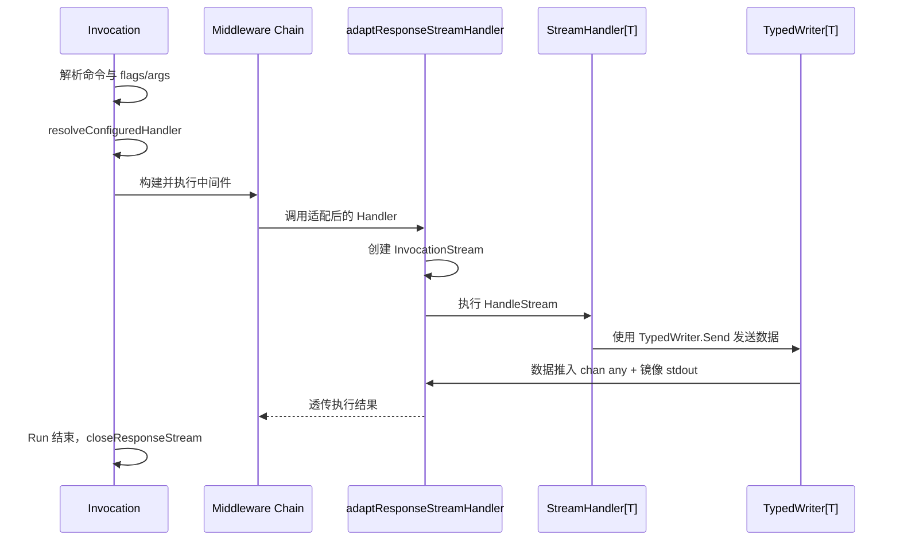
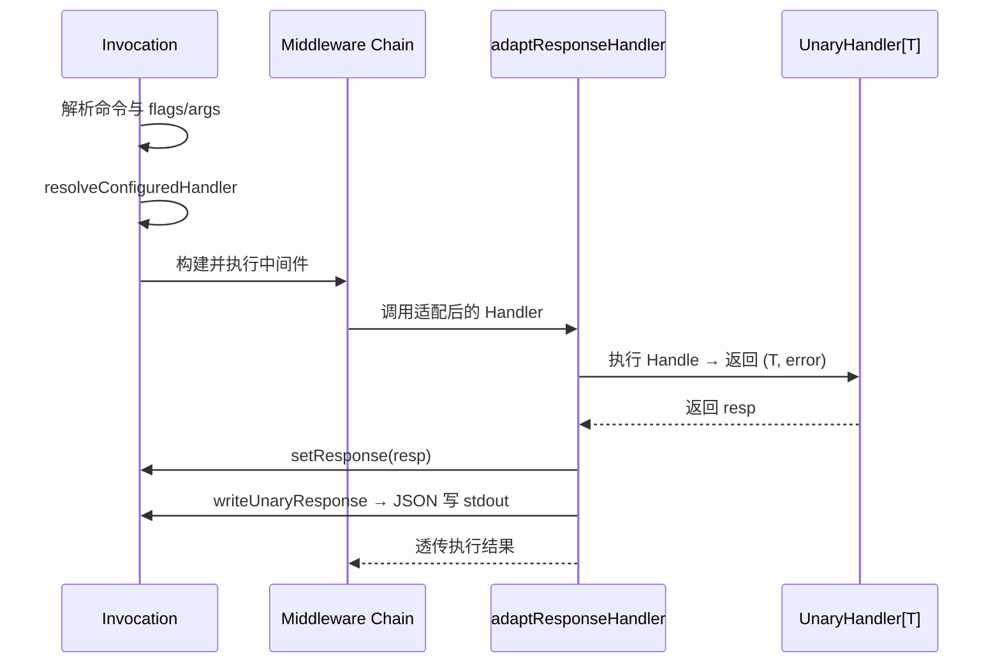
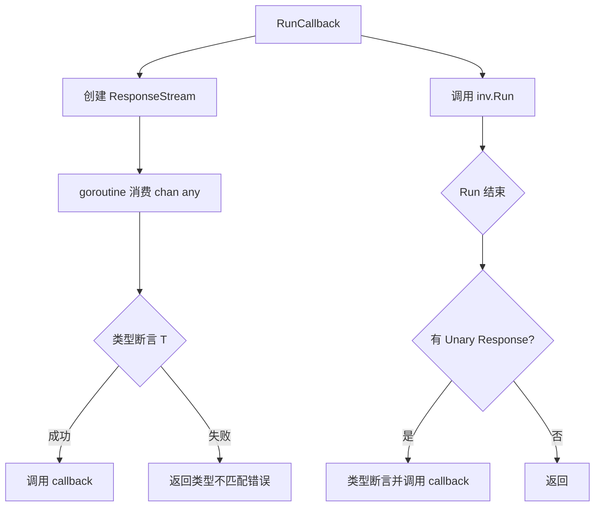
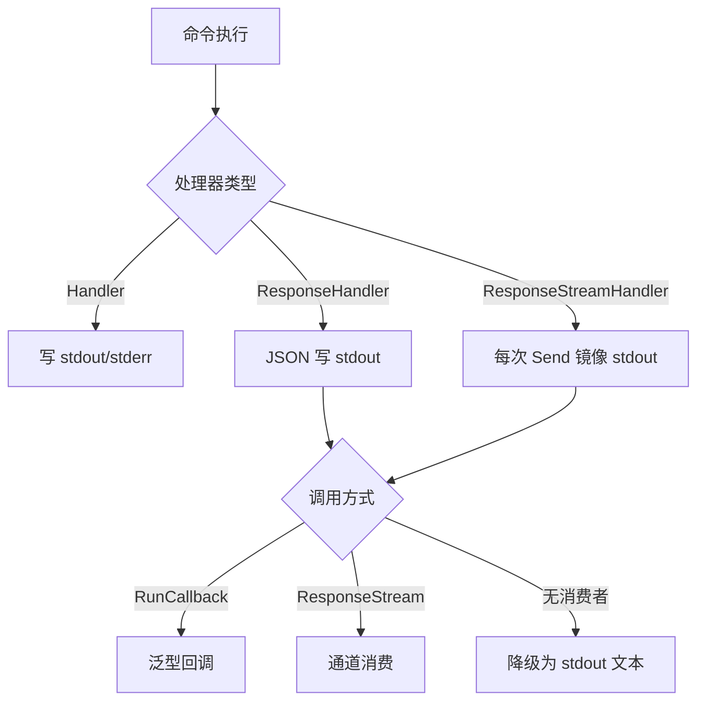
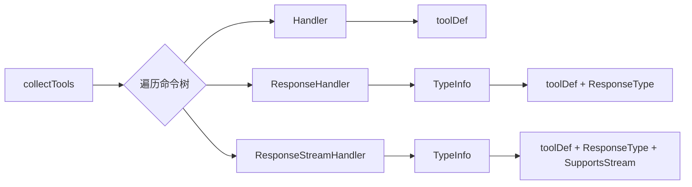
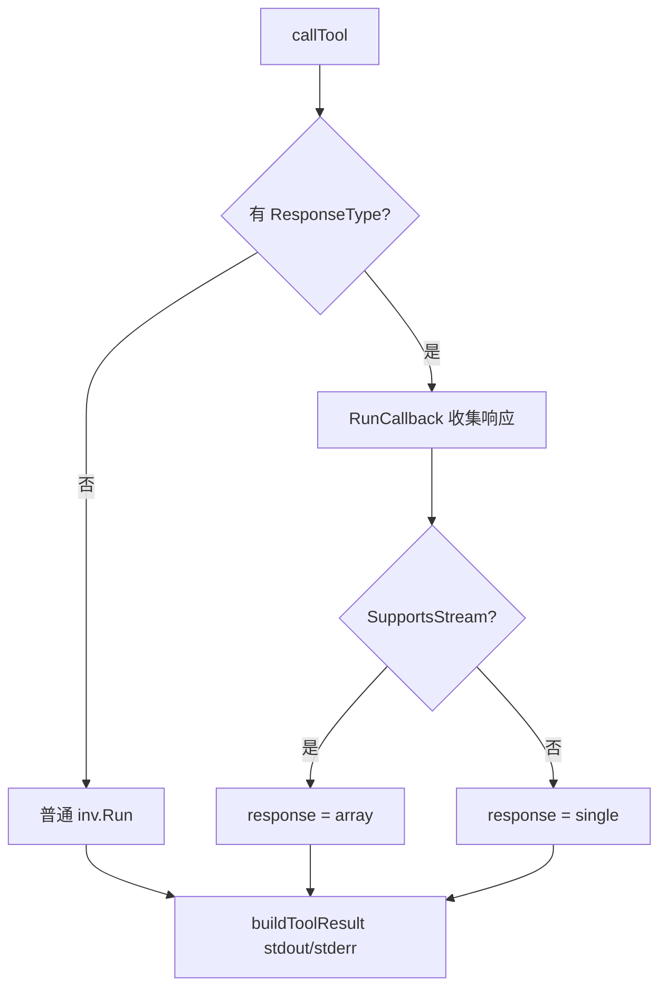

# 交互式命令与流式处理（Stream）

本文档说明 Redant 的交互式命令与响应流设计。

## 目标与原则

- 保持命令分发与中间件主链不变。
- 通过 `ResponseHandler` 提供 Unary 单响应能力。
- 通过 `ResponseStreamHandler` 提供结构化响应流输出能力。
- 响应流由 Invocation 内部创建并管理，`Run()` 结束后自动关闭。
- 流通道类型为 `chan any`，直接传递泛型数据，不再包装事件结构。
- `TypedWriter[T]` 提供类型安全的发送接口。

## 核心类型

### Command 扩展

三类处理器互斥，初始化阶段校验冲突：

| 字段                    | 类型                    | 说明                               |
| ----------------------- | ----------------------- | ---------------------------------- |
| `Handler`               | `HandlerFunc`           | 传统处理器，无结构化响应           |
| `ResponseHandler`       | `ResponseHandler`       | Unary 单响应，通过 `Unary[T]` 构造 |
| `ResponseStreamHandler` | `ResponseStreamHandler` | 流式响应，通过 `Stream[T]` 构造    |

### Invocation 扩展

- `ResponseStream() <-chan any`：消费响应流通道。
- `Response() (any, bool)`：获取 Unary 响应值。

### ResponseTypeInfo

运行时输出类型元数据，由 `ResponseHandler` 和 `ResponseStreamHandler` 通过 `TypeInfo()` 方法暴露：

```go
type ResponseTypeInfo struct {
    TypeName string // 例如 "VersionInfo"、"string"
    Schema   string // 可选 JSON Schema
}
```

### InvocationStream

`Send(data any)` 统一发送接口，行为：

1. 将数据推入内部 `chan any` 通道（供 `ResponseStream()` 消费）。
2. 自动镜像到 stdio：
   - `string` / `[]byte` → stdout
   - `StreamError` → stderr
   - 其他类型 → JSON 序列化后写 stdout

### TypedWriter[T]

泛型写入器，由 `Stream[T]` 适配器自动注入：

- `Send(v T) error`：发送泛型数据。
- `Raw() *InvocationStream`：获取底层流（高级场景）。

## 执行路径

### Stream（流式响应）



### Unary（单响应）



## 泛型回调消费（RunCallback）



## 开发任务同步

- [x] 增加 `InvocationStream` 与 `TypedWriter[T]`。
- [x] 增加 `ResponseHandler` / `ResponseStreamHandler` 接口与 `Unary[T]` / `Stream[T]` 泛型适配器。
- [x] 增加 `Invocation.ResponseStream()`。
- [x] 三类处理器互斥校验（`resolveConfiguredHandler`）。
- [x] `InvocationStream.Send` 直接发送 `any`，自动镜像 stdio。
- [x] `RunCallback[T]` 泛型回调消费。
- [x] 回归测试：stdio 回退 + channel 消费 + 类型不匹配。
- [ ] 后续任务：补充流式中间件（按事件级拦截）。

## 使用示例

### Unary 命令定义

```go
type VersionInfo struct {
    Version   string `json:"version"`
    BuildDate string `json:"buildDate"`
}

versionCmd := &redant.Command{
    Use: "version",
    ResponseHandler: redant.Unary(func(ctx context.Context, inv *redant.Invocation) (VersionInfo, error) {
        return VersionInfo{Version: "1.0.0", BuildDate: "2026-04-01"}, nil
    }),
}
```

### 流式命令定义

```go
chat := &redant.Command{
    Use: "chat",
    ResponseStreamHandler: redant.Stream(func(ctx context.Context, inv *redant.Invocation, out *redant.TypedWriter[string]) error {
        if err := out.Send("hello"); err != nil {
            return err
        }
        return out.Send("world")
    }),
}
```

### stdio 回退

直接 `Run()` 即可，文本数据自动写入 stdout：

```go
chat.Invoke().WithOS().Run()
```

### Unary 泛型回调

```go
err := redant.RunCallback[VersionInfo](versionCmd.Invoke(), func(v VersionInfo) error {
    fmt.Printf("version=%s build=%s\n", v.Version, v.BuildDate)
    return nil
})
```

### 流式泛型回调消费

```go
err := redant.RunCallback[string](chat.Invoke(), func(chunk string) error {
    fmt.Println(chunk)
    return nil
})
```

### 通道消费

```go
inv := chat.Invoke()
out := inv.ResponseStream()
inv.Run()
for data := range out {
    fmt.Println(data)
}
```

## 执行上下文兼容性

不同执行上下文对三类处理器的支持程度：

| 执行上下文                 | Handler            | ResponseHandler (Unary)                      | ResponseStreamHandler (Stream)                 |
| -------------------------- | ------------------ | -------------------------------------------- | ---------------------------------------------- |
| **直接 `inv.Run()`**       | 正常执行           | JSON 写 stdout                               | 文本镜像 stdout                                |
| **`RunCallback[T]`**       | 正常执行（无回调） | 回调调用一次                                 | 回调调用多次                                   |
| **`inv.ResponseStream()`** | 通道无数据         | 通道无数据，用 `Response()`                  | 通道接收流事件                                 |
| **MCP (`callTool`)**       | stdout 捕获        | `RunCallback` → `structuredContent.response` | `RunCallback` → `structuredContent.response[]` |
| **WebUI Stream WS**        | stdout 捕获        | stdout 捕获                                  | WebSocket 推送事件                             |
| **WebUI HTTP POST**        | stdout 捕获        | JSON stdout 捕获                             | 降级：文本 stdout 捕获                         |
| **readline / richline**    | stdout 捕获        | JSON stdout 捕获                             | 降级：文本 stdout 捕获                         |



**降级语义**：当流命令在不支持结构化流消费的上下文（如 readline、HTTP POST）中执行时，`InvocationStream.Send` 仅走 stdout/stderr 镜像路径。由于没有调用 `ResponseStream()`，内部通道不会创建，不会有死锁或内存泄漏。

## MCP 集成

MCP server（`internal/mcpserver`）完整支持三类处理器：

### 工具发现

`collectTools` 遍历命令树时检测三种处理器，并通过 `TypeInfo()` 获取运行时类型元数据：



### 输出 Schema

有类型元数据的命令，MCP `outputSchema` 会包含 `response` 字段：

- **Unary**：`response` 为单值，带 `x-redant-type` 标注类型名。
- **Stream**：`response` 为 `type: "array"`，带 `x-redant-type` 标注元素类型名。

### 工具调用



## 开发任务同步

- [x] 增加 `InvocationStream` 与 `TypedWriter[T]`。
- [x] 增加 `ResponseHandler` / `ResponseStreamHandler` 接口与 `Unary[T]` / `Stream[T]` 泛型适配器。
- [x] 增加 `ResponseTypeInfo` 运行时类型元数据。
- [x] 增加 `Invocation.ResponseStream()`。
- [x] 三类处理器互斥校验（`resolveConfiguredHandler`）。
- [x] `InvocationStream.Send` 直接发送 `any`，自动镜像 stdio。
- [x] `RunCallback[T]` 泛型回调消费。
- [x] MCP 工具发现、输出 Schema 与 `RunCallback` 调用集成。
- [x] WebUI 流式 WebSocket 端点（`/api/run/stream/ws`）。
- [x] 回归测试：stdio 回退 + channel 消费 + 类型不匹配。
- [ ] 后续任务：补充流式中间件（按事件级拦截）。