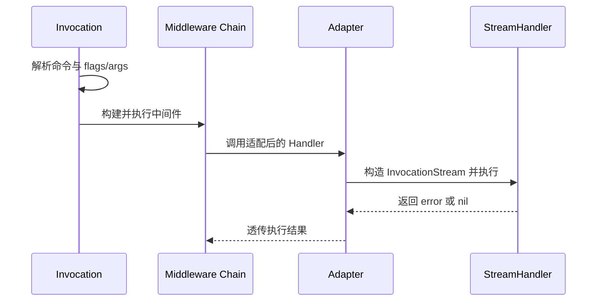

# 交互式命令与流式处理（Stream）

本文档说明 Redant 的交互式命令与响应流新协议设计（非兼容升级）。

## 目标与原则

- 保持命令分发与中间件主链不变。
- 通过新增 `StreamHandler` 提供结构化响应流输出能力。
- 响应流由 Invocation 内部创建并管理，`Run()` 结束后自动关闭。
- Stream 消息采用统一结构化协议，不再保留旧字段兼容层。
- 可按业务阶段发送多段输出；以 `stream.round.end` 事件表示一轮阶段输出完成。

## 新增模型

### Command 扩展

- 新增 `StreamHandler StreamHandlerFunc` 字段。
- 运行时优先级：`StreamHandler` > `Handler`。

### Invocation 扩展

- 新增 `ResponseStream() <-chan StreamMessage`。
- 响应流通道由内部创建，调用方仅消费，不注入。

### Stream 事件


事件类型：

- `output`：标准输出语义
- `error`：错误输出语义
- `control`：控制消息（如阶段边界、退出信号）

### StreamMessage 协议（JSON-RPC 风格）

为适配 command-as-web / command-as-mcp 场景，`StreamMessage` 使用统一结构化字段：

- `jsonrpc`：协议版本，默认 `2.0`
- `id`：请求/响应关联 ID（可选）
- `method`：方法名（默认形如 `stream.output`）
- `type`：消息类型（如 `input/output/error/control`）
- `data`：结构化负载
- `error`：结构化错误（`code/message/details`）
- `meta`：扩展元数据

说明：该模型为新协议，不保留 `Kind/Payload` 旧字段。

### Method 约定表

| method                | type      | 说明                       |
| --------------------- | --------- | -------------------------- |
| `stream.output`       | `output`  | 普通输出事件               |
| `stream.output.chunk` | `output`  | 分片输出事件               |
| `stream.control`      | `control` | 通用控制事件               |
| `stream.round.end`    | `control` | 当前阶段输出结束事件       |
| `stream.error`        | `error`   | 结构化错误事件             |
| `stream.exit`         | `control` | 会话结束事件（含退出信息） |

### Message ID 生命周期

- 发送消息时，若未显式设置 `id`，框架会自动生成。
- 生成规则：`<stream-id>-<seq>`，其中 `seq` 为单会话单调递增序号。
- `stream-id` 默认来自命令全名；若设置了 `inv.Annotations["request_id"]`，优先使用该值作为前缀来源。
- 建议上游（web/mcp）透传 `id` 以便全链路关联追踪。

## 执行路径



说明：

1. 中间件仍复用原 `MiddlewareFunc` 机制。
2. `AdaptStreamHandler` 将流处理器接入现有执行链。
3. `Send` 写入内部响应流，并可镜像到 `Stdout/Stderr`。
4. 可通过 `EndRound(reason)` 显式发送 `stream.round.end`，表示当前阶段结束。
5. `inv.Run()` 为阻塞调用；当执行结束时内部响应流会自动关闭。

## 开发任务同步（本次）

- [x] 增加 `StreamHandlerFunc` 与 `InvocationStream`。
- [x] 增加结构化 `StreamMessage` 协议与事件类型定义。
- [x] 增加 `Invocation.ResponseStream()`。
- [x] 在执行链中接入 `StreamHandler` 优先策略。
- [x] 增加回归测试：stdio 输出 + 内建响应流消费模式。
- [ ] 后续任务：补充流式中间件（按事件级拦截）。
- [x] 完成非兼容升级：移除旧消息字段兼容。

## 使用示例

```go
cmd := &redant.Command{
    Use: "chat",
    StreamHandler: func(ctx context.Context, stream *redant.InvocationStream) error {
        if err := stream.Control("phase:init"); err != nil {
            return err
        }
        if err := stream.Output("hello"); err != nil {
            return err
        }
        return stream.EndRound("done")
    },
}
```

说明：调用方通过 `ResponseStream()` 消费结构化响应事件。