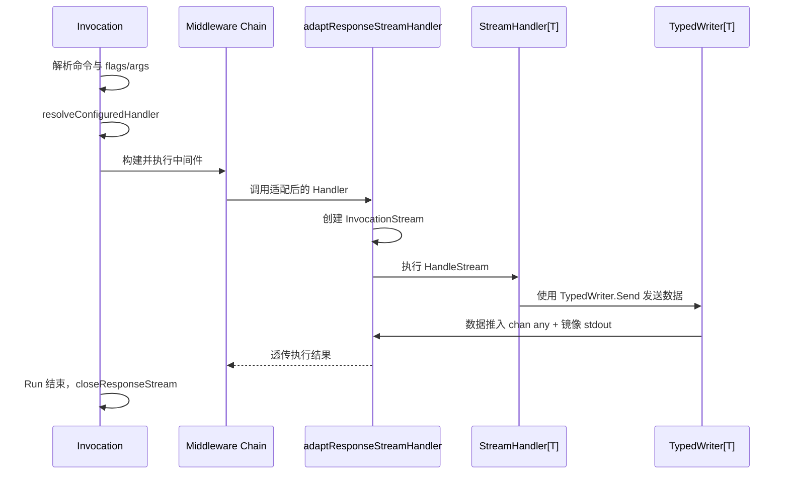
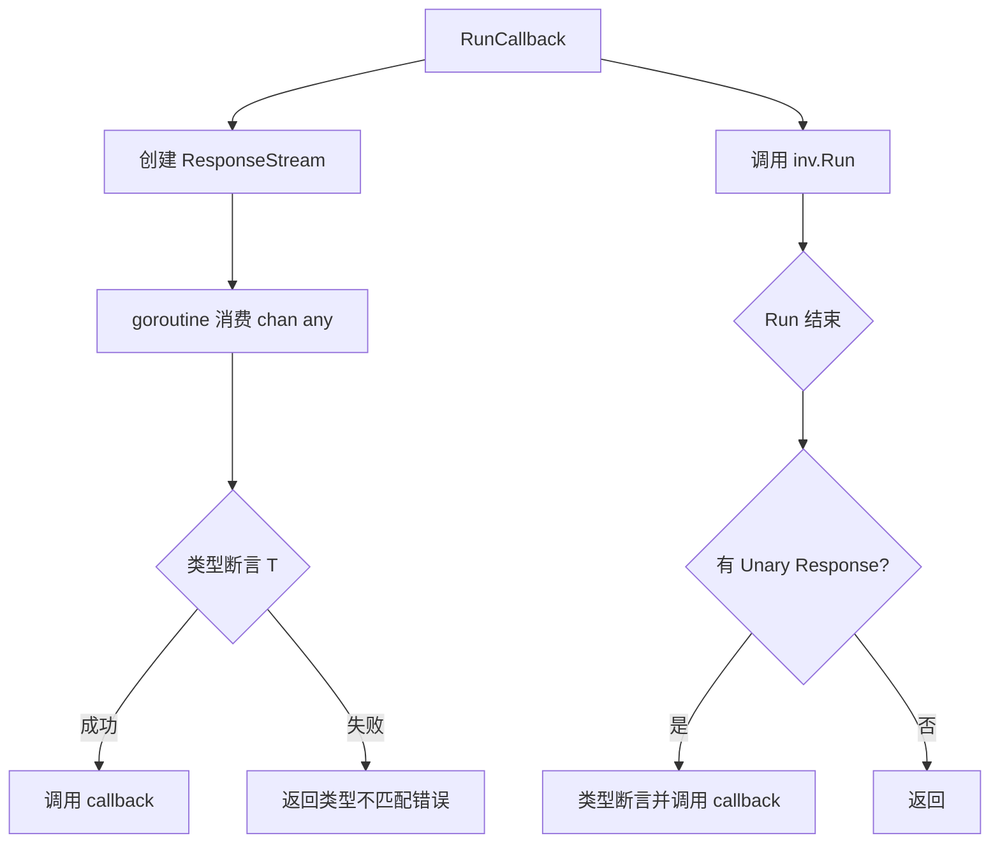

# 交互式命令与流式处理（Stream）

本文档说明 Redant 的交互式命令与响应流设计。

## 目标与原则

- 保持命令分发与中间件主链不变。
- 通过 `ResponseStreamHandler` 提供结构化响应流输出能力。
- 响应流由 Invocation 内部创建并管理，`Run()` 结束后自动关闭。
- 流通道类型为 `chan any`，直接传递泛型数据，不再包装事件结构。
- `TypedWriter[T]` 提供类型安全的发送接口。

## 核心类型

### Command 扩展

三类处理器互斥，初始化阶段校验冲突：

| 字段                    | 类型                    | 说明                               |
| ----------------------- | ----------------------- | ---------------------------------- |
| `Handler`               | `HandlerFunc`           | 传统处理器，无结构化响应           |
| `ResponseHandler`       | `ResponseHandler`       | Unary 单响应，通过 `Unary[T]` 构造 |
| `ResponseStreamHandler` | `ResponseStreamHandler` | 流式响应，通过 `Stream[T]` 构造    |

### Invocation 扩展

- `ResponseStream() <-chan any`：消费响应流通道。
- `Response() (any, bool)`：获取 Unary 响应值。

### InvocationStream

`Send(data any)` 统一发送接口，行为：

1. 将数据推入内部 `chan any` 通道（供 `ResponseStream()` 消费）。
2. 自动镜像到 stdio：
   - `string` / `[]byte` → stdout
   - `StreamError` → stderr
   - 其他类型 → JSON 序列化后写 stdout

### TypedWriter[T]

泛型写入器，由 `Stream[T]` 适配器自动注入：

- `Send(v T) error`：发送泛型数据。
- `Raw() *InvocationStream`：获取底层流（高级场景）。

## 执行路径



## 泛型回调消费（RunCallback）



## 开发任务同步

- [x] 增加 `InvocationStream` 与 `TypedWriter[T]`。
- [x] 增加 `ResponseHandler` / `ResponseStreamHandler` 接口与 `Unary[T]` / `Stream[T]` 泛型适配器。
- [x] 增加 `Invocation.ResponseStream()`。
- [x] 三类处理器互斥校验（`resolveConfiguredHandler`）。
- [x] `InvocationStream.Send` 直接发送 `any`，自动镜像 stdio。
- [x] `RunCallback[T]` 泛型回调消费。
- [x] 回归测试：stdio 回退 + channel 消费 + 类型不匹配。
- [ ] 后续任务：补充流式中间件（按事件级拦截）。

## 使用示例

### 流式命令定义

```go
chat := &redant.Command{
    Use: "chat",
    ResponseStreamHandler: redant.Stream(func(ctx context.Context, inv *redant.Invocation, out *redant.TypedWriter[string]) error {
        if err := out.Send("hello"); err != nil {
            return err
        }
        return out.Send("world")
    }),
}
```

### stdio 回退

直接 `Run()` 即可，文本数据自动写入 stdout：

```go
chat.Invoke().WithOS().Run()
```

### 泛型回调消费

```go
err := redant.RunCallback[string](chat.Invoke(), func(chunk string) error {
    fmt.Println(chunk)
    return nil
})
```

### 通道消费

```go
inv := chat.Invoke()
out := inv.ResponseStream()
inv.Run()
for data := range out {
    fmt.Println(data)
}
```