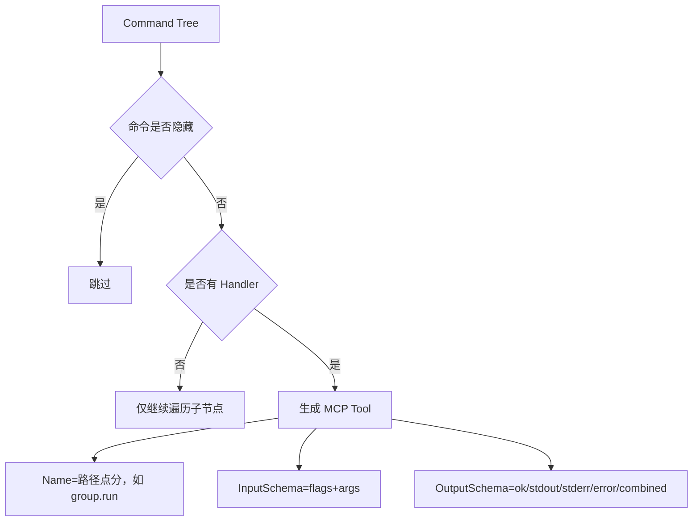

# Redant MCP 集成指南

本文档用于补全 Redant 在 Model Context Protocol（MCP）方向的使用说明，覆盖：

1. 如何在项目中挂载 `mcp` 子命令
2. `mcp list` / `mcp serve` 的用法
3. 命令树映射为 MCP tools 的规则
4. `tools/call` 的输入与输出结构
5. 常见问题排查

## 1. 快速接入

在你的根命令初始化处挂载：

```go
mcpcmd.AddMCPCommand(rootCmd)
```

挂载后会新增命令树：

```text
app mcp list
app mcp serve --transport stdio
```

## 2. 命令说明

### 2.1 `mcp list`

用于查看当前命令树映射出的 MCP tools 元信息。

- 默认格式：JSON
- 可选格式：`--format text`

示例：

```text
app mcp list
app mcp list --format text
```

输出包含：

- `name`：tool 名称（例如 `echo`、`group.run`）
- `description`：命令短/长描述拼接
- `path`：命令路径切片
- `inputSchema`：调用输入 Schema
- `outputSchema`：调用输出 Schema

### 2.2 `mcp serve`

启动 MCP Server 并对外暴露 tools。

当前支持：

- `--transport stdio`（默认）

示例：

```text
app mcp serve
app mcp serve --transport stdio
```

> 当前实现仅支持 `stdio`，其他 transport 会返回 `unsupported mcp transport`。

## 3. 工具映射规则

Redant 会遍历命令树，将可执行命令（有 Handler）映射为 MCP tool。

映射规则如下：

1. **命令可见性**：隐藏命令（`Hidden=true`）不会暴露。
2. **工具命名**：按命令路径用 `.` 拼接（例如 `group.run`）。
3. **标志继承**：会合并父命令标志；子命令可使用继承标志。
4. **标志过滤**：隐藏标志与系统标志不会出现在 schema（如 `help`、`list-commands`、`list-flags`、`args`）。
5. **参数 schema**：
   - 命令定义了 `ArgSet`：`arguments.args` 为对象（按参数名传值）。
   - 未定义 `ArgSet`：`arguments.args` 为数组（按位置传值）。

### 3.1 映射关系图



## 4. `tools/call` 输入结构

`arguments` 顶层结构：

```json
{
  "flags": {"...": "..."},
  "args": {"...": "..."}
}
```

或（命令无 `ArgSet` 时）：

```json
{
  "flags": {"...": "..."},
  "args": ["pos1", "pos2"]
}
```

### 4.1 有 `ArgSet` 的示例

```json
{
  "name": "deploy",
  "arguments": {
    "flags": {
      "stage": "dev",
      "dry-run": true
    },
    "args": {
      "service": "api"
    }
  }
}
```

### 4.2 无 `ArgSet` 的示例

```json
{
  "name": "scan",
  "arguments": {
    "flags": {
      "tags": ["x", "y"]
    },
    "args": ["path-a", "path-b"]
  }
}
```

## 5. `tools/call` 输出结构

Redant 返回 MCP 标准 `content`，同时通过 `structuredContent` 暴露结构化结果：

```json
{
  "content": [{"type": "text", "text": "..."}],
  "isError": false,
  "structuredContent": {
    "ok": true,
    "stdout": "...",
    "stderr": "...",
    "error": "",
    "combined": "..."
  }
}
```

字段语义：

- `ok`：命令是否执行成功。
- `stdout` / `stderr`：标准输出与错误输出。
- `error`：运行错误文本（成功时为空）。
- `combined`：便于展示的合并输出。

## 6. 类型映射速览

| Redant 值类型        | InputSchema 类型                   |
| -------------------- | ---------------------------------- |
| `string`             | `string`                           |
| `bool`               | `boolean`                          |
| `int` / `int64`      | `integer`                          |
| `float` / `float64`  | `number`                           |
| `string-array`       | `array<string>`                    |
| `enum[...]`          | `string` + `enum`                  |
| `enum-array[...]`    | `array<string>` + `items.enum`     |
| `struct[...]`/object | `object`（`additionalProperties`） |

补充：

- 对于 `Required=true` 的 flag，若已配置 `Default` 或 `Envs`，不会进入 schema 的 `required`。
- 对于 `Required=true` 的 arg，若已配置 `Default`，不会进入 schema 的 `required`。

## 7. 常见问题排查

### 7.1 为什么某个命令没有出现在 tools 列表？

优先检查：

1. 命令是否 `Hidden=true`
2. 命令是否有 `Handler`
3. 是否正确挂载了 `mcpcmd.AddMCPCommand(rootCmd)`

### 7.2 为什么调用报 `unknown flag`？

`arguments.flags` 中存在工具 schema 未声明的字段。请以 `mcp list` 返回的 `inputSchema.properties.flags` 为准。

### 7.3 为什么参数报错 `arguments.args must be ...`？

- 命令有 `ArgSet`：`arguments.args` 必须是对象。
- 命令无 `ArgSet`：`arguments.args` 必须是数组。

### 7.4 结构化参数（object/struct）怎么传？

可直接传对象，Redant 会在执行前序列化为 JSON 字符串传给命令值类型解析。

## 8. 相关文档

- 总览：[`../README.md`](../README.md)
- 设计：[`DESIGN.md`](DESIGN.md)
- 使用速览：[`USAGE_AT_A_GLANCE.md`](USAGE_AT_A_GLANCE.md)