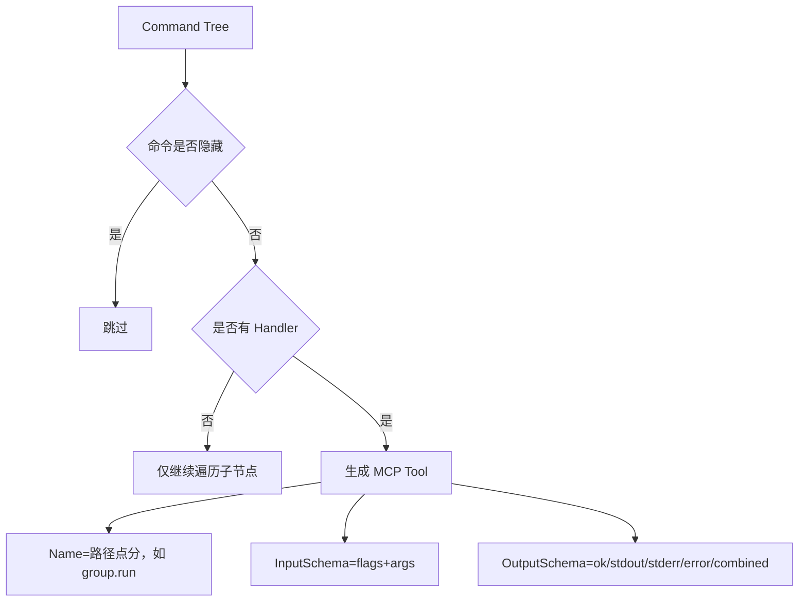

# Redant MCP 集成指南

本文档用于补全 Redant 在 Model Context Protocol（MCP）方向的使用说明，覆盖：

1. 如何在项目中挂载 `mcp` 子命令
2. `mcp list` / `mcp serve` 的用法
3. 命令树映射为 MCP tools 的规则
4. `tools/call` 的输入与输出结构
5. 常见问题排查

## 1. 快速接入

在你的根命令初始化处挂载：

```go
mcpcmd.AddMCPCommand(rootCmd)
```

挂载后会新增命令树：

```text
app mcp list
app mcp serve --transport stdio
```

## 2. 命令说明

### 2.1 `mcp list`

用于查看当前命令树映射出的 MCP tools 元信息。

- 默认格式：JSON
- 可选格式：`--format text`

示例：

```text
app mcp list
app mcp list --format text
```

输出包含：

- `name`：tool 名称（例如 `echo`、`group.run`）
- `description`：命令短/长描述拼接
- `path`：命令路径切片
- `inputSchema`：调用输入 Schema
- `outputSchema`：调用输出 Schema

### 2.2 `mcp serve`

启动 MCP Server 并对外暴露 tools。

当前支持：

- `--transport stdio`（默认）

示例：

```text
app mcp serve
app mcp serve --transport stdio
```

> 当前实现仅支持 `stdio`，其他 transport 会返回 `unsupported mcp transport`。

## 3. 工具映射规则

Redant 会遍历命令树，将可执行命令（有 Handler）映射为 MCP tool。

映射规则如下：

1. **命令可见性**：隐藏命令（`Hidden=true`）不会暴露。
2. **工具命名**：按命令路径用 `.` 拼接（例如 `group.run`）。
3. **标志继承**：会合并父命令标志；子命令可使用继承标志。
4. **标志过滤**：隐藏标志与系统标志不会出现在 schema（如 `help`、`list-commands`、`list-flags`、`args`）。
5. **参数 schema**：
   - 命令定义了 `ArgSet`：`arguments.args` 为对象（按参数名传值）。
   - 未定义 `ArgSet`：`arguments.args` 为数组（按位置传值）。

### 3.1 映射关系图



## 4. `tools/call` 输入结构

`arguments` 顶层结构：

```json
{
  "flags": {"...": "..."},
  "args": {"...": "..."}
}
```

或（命令无 `ArgSet` 时）：

```json
{
  "flags": {"...": "..."},
  "args": ["pos1", "pos2"]
}
```

### 4.1 有 `ArgSet` 的示例

```json
{
  "name": "deploy",
  "arguments": {
    "flags": {
      "stage": "dev",
      "dry-run": true
    },
    "args": {
      "service": "api"
    }
  }
}
```

### 4.2 无 `ArgSet` 的示例

```json
{
  "name": "scan",
  "arguments": {
    "flags": {
      "tags": ["x", "y"]
    },
    "args": ["path-a", "path-b"]
  }
}
```

## 5. `tools/call` 输出结构

Redant 返回 MCP 标准 `content`，同时通过 `structuredContent` 暴露结构化结果：

```json
{
  "content": [{"type": "text", "text": "..."}],
  "isError": false,
  "structuredContent": {
    "ok": true,
    "stdout": "...",
    "stderr": "...",
    "error": "",
    "combined": "..."
  }
}
```

字段语义：

- `ok`：命令是否执行成功。
- `stdout` / `stderr`：标准输出与错误输出。
- `error`：运行错误文本（成功时为空）。
- `combined`：便于展示的合并输出。

## 6. 类型映射速览

| Redant 值类型        | InputSchema 类型                   | format / 约束                           |
| -------------------- | ---------------------------------- | --------------------------------------- |
| `string`             | `string`                           |                                         |
| `bool`               | `boolean`                          |                                         |
| `int` / `int64`      | `integer`                          |                                         |
| `float` / `float64`  | `number`                           |                                         |
| `string-array`       | `array<string>`                    |                                         |
| `enum[...]`          | `string` + `enum`                  |                                         |
| `enum-array[...]`    | `array<string>` + `items.enum`     |                                         |
| `struct[...]`/object | `object`（`additionalProperties`） |                                         |
| `duration`           | `string`                           | `format: duration`（如 30s, 5m, 1h30m） |
| `url`                | `string`                           | `format: uri`                           |
| `regexp`             | `string`                           | `format: regex`                         |
| `host:port`          | `string`                           | `pattern: ^[^:]+:\d+$`                  |
| `json`               | `string`                           | `contentMediaType: application/json`    |

补充：

- 对于 `Required=true` 的 flag，若已配置 `Default` 或 `Envs`，不会进入 schema 的 `required`。
- 对于 `Required=true` 的 arg，若已配置 `Default`，不会进入 schema 的 `required`。

## 7. 常见问题排查

### 7.1 为什么某个命令没有出现在 tools 列表？

优先检查：

1. 命令是否 `Hidden=true`
2. 命令是否有 `Handler`
3. 是否正确挂载了 `mcpcmd.AddMCPCommand(rootCmd)`

### 7.2 为什么调用报 `unknown flag`？

`arguments.flags` 中存在工具 schema 未声明的字段。请以 `mcp list` 返回的 `inputSchema.properties.flags` 为准。

### 7.3 为什么参数报错 `arguments.args must be ...`？

- 命令有 `ArgSet`：`arguments.args` 必须是对象。
- 命令无 `ArgSet`：`arguments.args` 必须是数组。

### 7.4 结构化参数（object/struct）怎么传？

可直接传对象，Redant 会在执行前序列化为 JSON 字符串传给命令值类型解析。

## 8. MCP Resources

MCP Server 自动注册以下资源，LLM 可在调用工具前读取以获得上下文：

| URI 模式                       | 类型               | 说明                                             |
| ------------------------------ | ------------------ | ------------------------------------------------ |
| `redant://<app>/llms.txt`      | `text/markdown`    | 完整命令树文档（命令、参数、选项、响应类型）     |
| `redant://<app>/help/<tool>`   | `text/markdown`    | 单命令 Markdown 帮助                             |
| `redant://<app>/schema/<tool>` | `application/json` | 单命令 JSON Schema（inputSchema + outputSchema） |

## 9. MCP Prompts

MCP Server 注册提示模板，Agent 可通过 `prompts/list` 发现并使用：

| 名称             | 说明                                     |
| ---------------- | ---------------------------------------- |
| `<app>-overview` | 全局命令概览，返回完整 llms.txt 文档     |
| `use-<tool>`     | 单命令调用指南，支持传入参数值作为上下文 |

## 10. Agent Hints（命令元数据）

通过 `Command.Metadata` 设置 Agent 语义提示，MCP tool description 会自动附加这些信息：

| 键名                          | 含义               | 示例值               |
| ----------------------------- | ------------------ | -------------------- |
| `agent.readonly`              | 命令是否只读       | `true`               |
| `agent.idempotent`            | 命令是否幂等       | `true`               |
| `agent.destructive`           | 命令是否有破坏性   | `true`               |
| `agent.open-world`            | 是否涉及外部世界   | `true`               |
| `agent.requires-confirmation` | 调用前是否需要确认 | `true`               |
| `agent.side-effects`          | 副作用描述         | `writes to database` |

这些 metadata 键会被映射到两个层面：

1. **MCP ToolAnnotations（标准协议字段）**：`agent.readonly` → `readOnlyHint`，`agent.idempotent` → `idempotentHint`，`agent.destructive` → `destructiveHint`，`agent.open-world` → `openWorldHint`。这些是 MCP 协议原生支持的 Tool 注解，客户端可直接消费。
2. **Description 文本追加**：所有 `agent.*` 键值对会以结构化文本追加到 tool description 末尾，供不支持 ToolAnnotations 的客户端解析。

用法示例：

```go
cmd := &redant.Command{
    Use:   "delete [id]",
    Short: "Delete a resource.",
    Metadata: map[string]string{
        "agent.destructive":           "true",
        "agent.requires-confirmation": "true",
    },
    Handler: deleteHandler,
}
```

## 11. Typed Response Schema

当命令使用 `Unary` 或 `Stream` 类型化响应时，`outputSchema` 的 `response` 字段会包含完整 JSON Schema：

```json
{
  "response": {
    "type": "object",
    "properties": {
      "ok": {"type": "boolean"},
      "message": {"type": "string"}
    },
    "description": "typed response payload (main.StatusResult)",
    "x-redant-type": "main.StatusResult"
  }
}
```

Stream 类型响应 schema 中 `response` 的 `type` 为 `array`，`items` 为元素 schema。

## 12. 参数输入模式（x-redant-arg-modes）

当命令定义了 `ArgSet` 时，`inputSchema` 的 `args` 字段会包含扩展属性 `x-redant-arg-modes`，声明该命令支持的参数输入格式：

```json
{
  "args": {
    "type": "object",
    "properties": { ... },
    "x-redant-arg-modes": ["positional", "query", "form", "json"]
  }
}
```

各模式含义：

| 模式         | 格式示例                | 说明               |
| ------------ | ----------------------- | ------------------ |
| `positional` | `app cmd val1 val2`     | 按序传位置参数     |
| `query`      | `app cmd "k1=v1&k2=v2"` | URL query 编码     |
| `form`       | `app cmd k1=v1 k2=v2`   | 空格分隔 key=value |
| `json`       | `app cmd '{"k1":"v1"}'` | JSON 格式          |

## 13. llms-txt JSON 输出

`llms-txt` 子命令支持 `--format json` 输出结构化 JSON，方便程序化消费：

```bash
app llms-txt --format json
```

输出为完整命令树的 JSON 表示，包含 `name`、`short`、`long`、`aliases`、`args`、`options`、`response`、`metadata`、`children` 等字段。

## 14. MCP Tool 超时策略

通过 `Command.Metadata` 设置 `agent.timeout`，可为单个 MCP tool 配置调用超时：

```go
cmd := &redant.Command{
    Use:   "deploy",
    Short: "Deploy to production.",
    Metadata: map[string]string{
        "agent.timeout": "30s",  // Go duration 格式
    },
    Handler: deployHandler,
}
```

未设置时不施加超时（继承上游 context 的 deadline）。值格式遵循 Go `time.ParseDuration`，支持 `"5s"`、`"2m"`、`"1h30m"` 等。

## 15. Stream Envelope 序号与时间戳

Stream 响应的 NDJSON envelope 自动包含 `seq`（0-based 递增序号）和 `ts`（Unix 毫秒时间戳）：

```json
{"$":"resp","type":"Event","data":{"msg":"started"},"seq":0,"ts":1714300000000}
{"$":"resp","type":"Event","data":{"msg":"done"},"seq":1,"ts":1714300001000}
```

- `seq`：同一 stream 内从 0 开始递增，可用于排序和去重。
- `ts`：发送时刻的 Unix 毫秒时间戳。
- Unary 响应不包含这两个字段（保持向后兼容）。

## 16. `--list-commands` / `--list-flags` JSON 输出

全局 flag `--list-format` 支持 `text`（默认）和 `json` 两种格式：

```bash
app --list-commands --list-format json
app --list-flags --list-format json
```

JSON 输出结构便于工具链消费，`--list-commands` 输出命令数组，`--list-flags` 输出 flag 数组（含 `isGlobal` 标记）。

## 17. 相关文档

- 总览：[`../README.md`](../README.md)
- 设计：[`DESIGN.md`](DESIGN.md)
- 使用速览：[`USAGE_AT_A_GLANCE.md`](USAGE_AT_A_GLANCE.md)