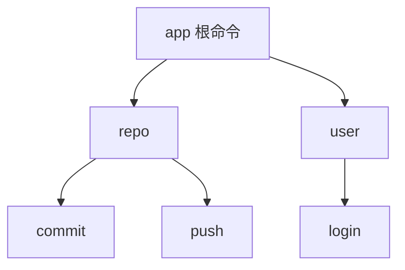
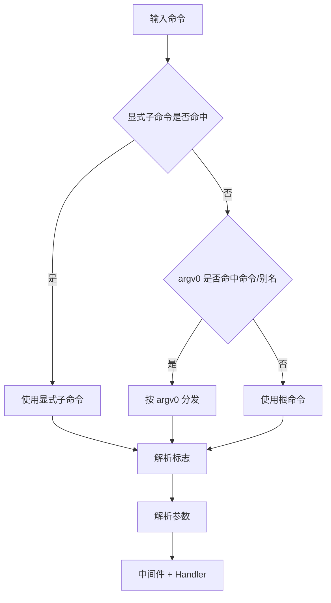

# Redant 使用规范速览

本文档用于说明 Redant 的核心使用规范，覆盖以下内容：

1. 子命令命名与层级组织规范
2. 参数输入格式规范
3. 标志（Flag）定义与调用规范

## 1) 子命令命名与组织规范

### 命令树组织方式



- 每个命令的名称来自 `Command.Use` 的第一个词。
  - 例如：`Use: "commit [flags] [args...]"`，命令名就是 `commit`。
- 子命令通过 `Children` 挂在父命令下。
- 可通过 `Aliases` 定义别名（如 `commit` 的别名 `ci`）。

### 调用方式

1. 空格路径：`app repo commit`
2. 冒号路径：`app repo:commit`

两种方式均可定位到同一子命令节点。

## 2) 参数输入格式规范

参数（Args）是命令后面非标志（Flag）的部分，常见 4 种形态：

| 参数形态   | 示例                                               | 说明            |
| ---------- | -------------------------------------------------- | --------------- |
| 位置参数   | `app repo commit "feat: init"`                     | 按顺序读取      |
| 查询串参数 | `app repo commit "message=feat&sign=true"`         | `&` 分隔键值    |
| 表单参数   | `app repo commit "message=feat sign=true"`         | 空格分隔键值    |
| JSON 参数  | `app repo commit '{"message":"feat","sign":true}'` | 对象/数组都支持 |

参数解析函数：

- `ParseQueryArgs()`
- `ParseFormArgs()`
- `ParseJSONArgs()`

## 3) 标志（Flag）定义与调用规范

标志（Flag）由 `OptionSet` 定义，常见形态如下：

| 形态         | 示例                               | 说明                 |
| ------------ | ---------------------------------- | -------------------- |
| 长选项       | `--author alice`                   | 标准长标志           |
| 等号写法     | `--author=alice`                   | 与上面等价           |
| 短选项       | `-a alice`                         | `Shorthand` 对应短名 |
| 布尔开关     | `--sign`                           | bool 类型可无值开启  |
| 环境变量回退 | `GIT_AUTHOR=alice app repo commit` | `Envs` 配置生效      |
| 默认值       | 未传值时自动应用                   | 由 `Default` 指定    |

内建全局标志：

- `--env, -e KEY=VALUE`：设置环境变量（支持重复与 CSV）。
- `--env-file FILE`：从 env 文件加载环境变量（支持重复与 CSV）。
- `--args VALUE`：内部隐藏标志；支持重复与 CSV，用于覆盖命令位置参数。

快速示例：

```text
app demo -e A=1 -e B=2
app demo --env A=1,B=2
app demo --env-file .env
app demo --env-file .env --env-file .env.local
app demo --env-file .env,.env.local
app demo --args first --args second
app demo --args first,second
```

说明：`--args` 为内部能力，默认不会出现在帮助信息与 `--list-flags` 输出中。

## 4) 通用输入模板

```text
app [command[:sub-command] | command sub-command] [flags...] [args...]
```

示例：

```text
app repo commit "message=feat&sign=true" --author=alice --sign
```

补充说明：

- 非 `RawArgs` 模式下，`[flags...]` 与 `[args...]` 的先后位置均可解析。
- 为减少与子命令名称冲突的歧义，推荐使用“先 flags，后 args”的写法。

## 5) Web 调用过程展示约定

`web` 子命令执行后，页面中的“调用过程”会展示两部分：

1. `curl` 风格请求（便于复现 API 调用）。
2. CLI 多行命令（`\` 续行，便于检查长参数链路）。

其中 CLI 视图默认将 Args 放在末尾，并附加注释行用于核对命名参数映射：

- `# args: version=v0.0.1-alpha.10`
- `# rawArgs: [v0.0.1-alpha.10]`

## 6) 解析优先级



优先级顺序如下：

1. 显式子命令
2. `argv0` 分发
3. 根命令
4. 标志与参数解析

## 7) 最小实现示例（命令、参数与标志）

```go
root := &redant.Command{Use: "app"}

repo := &redant.Command{Use: "repo", Short: "仓库操作"}

var (
    author string
    sign   bool
)

commit := &redant.Command{
    Use:     "commit [message]",
    Aliases: []string{"ci"},
    Short:   "提交代码",
    Options: redant.OptionSet{
        {Flag: "author", Shorthand: "a", Envs: []string{"GIT_AUTHOR"}, Default: "unknown", Value: redant.StringOf(&author)},
        {Flag: "sign", Shorthand: "s", Value: redant.BoolOf(&sign)},
    },
    Handler: func(ctx context.Context, inv *redant.Invocation) error {
        // inv.Args[0] 可读取 message
        return nil
    },
}

repo.Children = append(repo.Children, commit)
root.Children = append(root.Children, repo)
```

## 8) 交互式命令（StreamHandler）

当命令需要“结构化流式输出”时，可使用 `StreamHandler`：

```go
chat := &redant.Command{
    Use: "chat",
    StreamHandler: func(ctx context.Context, stream *redant.InvocationStream) error {
        if err := stream.Control("phase:init"); err != nil {
            return err
        }
        if err := stream.Output("hello"); err != nil {
            return err
        }
        return stream.EndRound("done")
    },
}
```

说明：

- 响应输出通过 `out := inv.ResponseStream()` 消费；`Run()` 结束后响应流自动关闭。
- 现有 `Handler` 与 `Middleware` 仍可继续使用，兼容不变。
