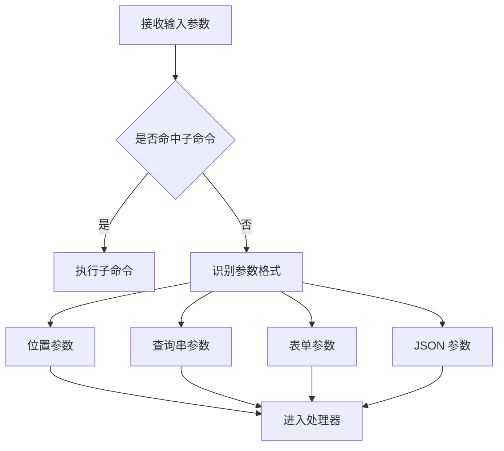
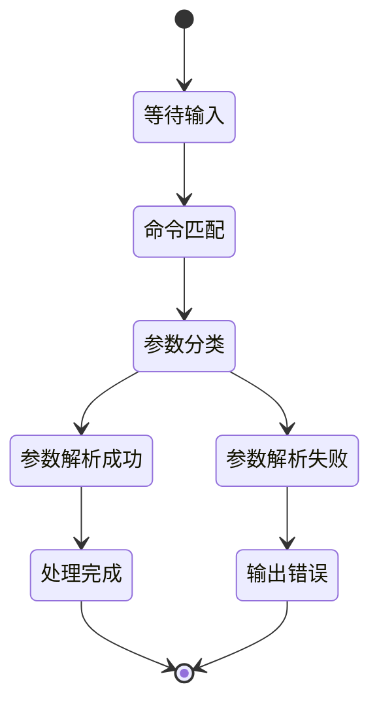
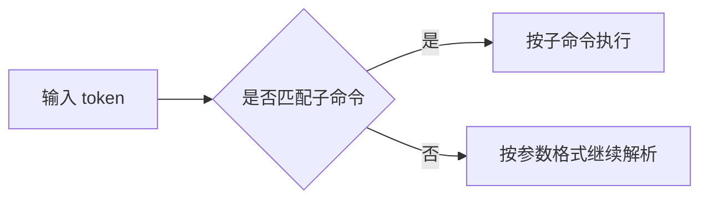

# 参数解析示例说明

本示例用于演示 Redant 对多种参数格式的处理方式，以及命令解析与参数解析之间的优先级关系。

> 关联文档：[`README`](../../README.md) · [`设计文档`](../../docs/DESIGN.md)

## 解析流程图



## 解析状态图



## 支持的参数格式

### 1) 位置参数

```bash
./args-test multi arg1 arg2 arg3
```

### 2) 查询串格式

```bash
./args-test query "name=张三&age=30&tags=go&tags=cli"
```

- 使用 `&` 分隔多个键值对
- 允许重复键
- 在处理器中使用 `ParseQueryArgs()` 解析

### 3) 表单格式

```bash
./args-test form "user=admin email=admin@example.com active=true"
```

- 使用空格分隔多个键值对
- 支持带引号的值
- 在处理器中使用 `ParseFormArgs()` 解析

### 4) JSON 格式

```bash
./args-test json '{"id":123,"title":"测试","count":42}'
./args-test json '["v1","v2","v3"]'
```

- 支持 JSON 对象与数组
- 在处理器中使用 `ParseJSONArgs()` 解析

## 子命令与参数冲突优先级



规则：

1. 优先做子命令匹配。
2. 未命中子命令时，再按参数格式识别与解析。

## 常用测试命令

```bash
./args-test conflict "value=test"
./args-test conflict sub
./args-test complex "pos1" "flag1=value1" "flag2=100"
./test.sh
```

## 说明

- 含特殊字符参数请使用引号包裹。
- JSON 建议使用单引号包裹，避免 shell 转义问题。
- 位置参数与键值参数可混用，但应保持顺序可读。
