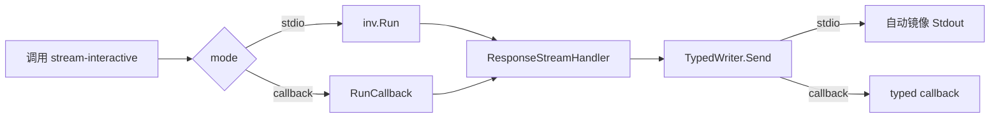

# stream-interactive 示例

这个示例展示 Redant 在"纯响应流"语义下的两种运行方式：

1. `stdio`：直接执行 `inv.Run()`，输出落到终端。
2. `callback`：通过 `RunCallback` 消费类型化输出数据，适合函数调用场景。

并且在 `callback` 模式下会实时打印类型化输出文本（`string`）。

## 调用流程



## 运行方式

### 1) 终端交互模式（stdio）

```bash
go run ./example/stream-interactive stdio
```

运行后可直接看到文本输出（`TypedWriter[string].Send` 自动镜像到 stdout）。

### 2) 回调模式（callback）

```bash
go run ./example/stream-interactive callback
```

该模式会通过 `RunCallback[string]` 实时接收并打印文本输出。

> 兼容说明：`channel` 仍作为别名可用，便于旧脚本平滑迁移。

## 关键代码点

- 命令定义：`ResponseStreamHandler: redant.Stream(...)`
- 泛型写入：`out.Send("hello")` （`TypedWriter[string].Send`）
- 回调执行：`RunCallback[T](inv, callback)`

## 阻塞语义说明

- `inv.Run()` 是阻塞调用。
- 在 `RunCallback` 模式中，流通道中的数据会类型断言为 `T` 并分发到回调；类型不匹配时返回错误。
- `Run()` 结束后流自动关闭。
- 推荐始终通过 `context` 设置超时/取消，避免上游异常导致无限等待。
