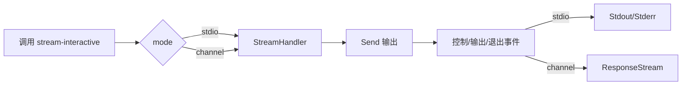

# stream-interactive 示例

这个示例展示 Redant 新增的 `StreamHandler` 在两种场景下的完整用法：

1. `stdio`：命令在本地终端输出控制与业务消息。
2. `channel`：通过 `ResponseStream()` 消费结构化响应事件，适合接 WebSocket/MCP/SSE 等上游。

并且在 `channel` 模式下会打印 JSON 序列化后的 `StreamMessage`，可以直接看到 `type/method/jsonrpc` 等结构化输出字段。

> 注意：当前为新协议模型，不再使用旧的 `Kind/Payload` 字段。

## 调用流程



## 运行方式

### 1) 终端交互模式（stdio）

```bash
go run ./example/stream-interactive stdio
```

运行后可直接看到控制信息与输出内容。

### 2) 通道模式（channel）

```bash
go run ./example/stream-interactive channel
```

该模式会从 `ResponseStream` 读取并打印输出事件 JSON（含 `jsonrpc/id/type/method/round/data/error/meta`）。

## 关键代码点

- 命令定义：`StreamHandler func(ctx, stream) error`
- 响应流：`out := inv.ResponseStream()`
- 事件模型：`StreamMessage{jsonrpc,id,method,type,data,error,meta}`
- 轮次结束：`stream.EndRound("...")` -> `stream.round.end`
- `request_id`：可通过 `inv.Annotations["request_id"]` 影响消息 ID 前缀

## 阻塞语义说明

- `inv.Run()` 是阻塞调用。
- 响应事件会写入内部 `ResponseStream`；`Run()` 结束后流自动关闭。
- 推荐始终通过 `context` 设置超时/取消，避免上游异常导致无限等待。
