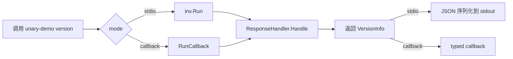

# unary 示例

展示 Redant `ResponseHandler` + `Unary[T]` 泛型适配器的两种运行方式。

## 核心概念

`ResponseHandler` 适用于"请求→单响应"场景（类似 RPC 的 Unary 调用）：

- 处理器返回一个结构体，框架自动 JSON 序列化写入 stdout。
- 调用方可通过 `RunCallback[T]` 直接获取类型化响应对象。
- 与 `ResponseStreamHandler`（流式）互斥，同一命令只能配置一种。

## 调用流程



## 运行方式

```bash
go run ./example/unary
```

输出：

```
=== stdio 模式（JSON 自动输出到 stdout）===
{"version":"1.2.3","buildDate":"2026-04-01","goVersion":"go1.23"}
=== callback 模式（RunCallback 泛型回调）===
  Version:   1.2.3
  BuildDate: 2026-04-01
  GoVersion: go1.23
=== 完成 ===
```

## 关键代码点

- 命令定义：`ResponseHandler: redant.Unary(func(...) (VersionInfo, error) {...})`
- 泛型回调：`RunCallback[VersionInfo](inv, callback)`
- stdio 回退：`inv.Run()` 自动将响应 JSON 序列化到 stdout

## 与 Stream 的区别

| 维度             | Unary (`ResponseHandler`) | Stream (`ResponseStreamHandler`) |
| ---------------- | ------------------------- | -------------------------------- |
| 响应次数         | 一次                      | 多次                             |
| 适配器           | `Unary[T]`                | `Stream[T]`                      |
| 写入器           | 无（直接返回值）          | `TypedWriter[T].Send`            |
| RunCallback 行为 | 回调调用一次              | 回调调用多次                     |
| stdout 回退      | JSON 序列化               | 每次 Send 镜像                   |
